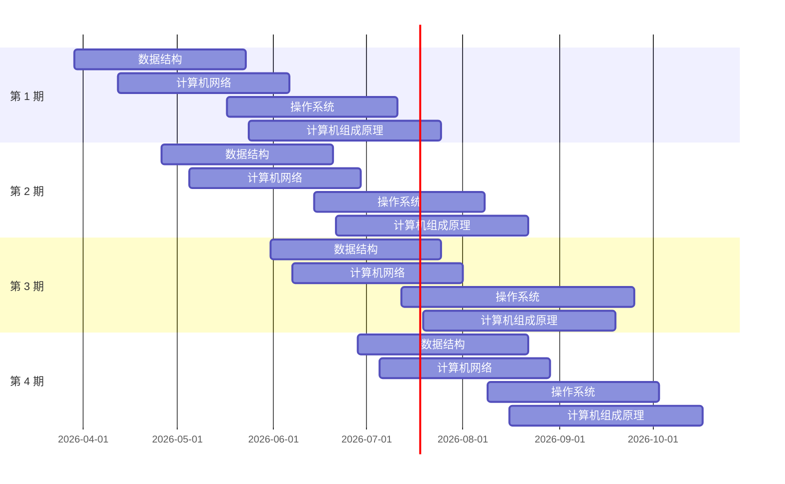

# 专业课（$150'$，$180 min$）

- **数据结构**：45'
- **计算机组成原理**：45'
- **操作系统**：35'
- **计算机网络**：25'

## 单选题（$40 \times 2' = 80'$）

- **数据结构**：1～10
- **计算机组成原理**：11～22
- **操作系统**：23～32
- **计算机网络**：33～40

## 应用题（7 题，$(10' + 15') + (8' + 13') + (7' + 8') + 9' = 70'$）

- **数据结构**：41（10'）、42（15'）
- **计算机组成原理**：43（8'）、44（13'）
- **操作系统**：45（7'）、46（8'）
- **计算机网络**：47（9'）

# 专业课督学营周计划

| --- | 第一期 | 第二期 | 第三期 | 第四期 |
| :---: | :---: | :---: | :---: | :---: |
| **数据结构** | 3.29 - 5.23 | 4.26 - 6.20 | 5.31 - 7.25 | 6.28 - 8.22 |
| **计算机网络** | 4.12 - 6.6 | 5.5 - 6.29 | 6.7 - 8.1 | 7.5 - 8.29 |
| **操作系统** | 5.17 - 7.11 | 6.14 - 8.8 | 7.12 - 9.5 | 8.9 - 10.3 |
| **计算机组成原理** | 5.24 - 7.25 | 6.21 - 8.22 | 7.19 - 9.19 | 8.16 - 10.17 |

专业课的复习，需要「听」、「看」、「练」三个环节：

1. 「听」视频讲解。可以帮助基础不好的同学更轻松地理解各个知识点，降低学习门槛。为了照顾不同基础的同学，视频讲解在内容上难免会有冗余，因此建议大家主要在第一轮打基础阶段听视频讲解，后续几轮复习以王道书为主，效率更高。
2. 「看」王道书。可以压缩知识篇幅，边看王道书边在书上或笔记本上建立自己的笔记，形成独属于你的理解，有助于后续几轮的快速复习。
3. 「练」王道课后习题。俗话说——是骡子是马拉出来溜溜。往年有不少同学为了追求进度，光看书不练习，重量不重质，导致后序几轮复习基础太差，备受打击。因此做课后习题非常重要，非常重要，非常重要。通过做课后习题，才能客观反应个人学习情况，并能让大家掌握考试的技巧和套路。

古人言：「王道领进门，修仙在个人。」做题训练，是考研修仙的必经之路，预祝大家在每一个环节，都能修真悟道，成功渡劫。根据题目难度不同，修仙等级有三：

1. 掌握第一等级题目的同学，江湖人称——「道上人」
2. 掌握第二等级题目的同学，江湖人称——「道上佬」
3. 掌握第三等级题目的同学，江湖人称——「道上仙」

愿各位潜心修炼，我们顶峰相见。