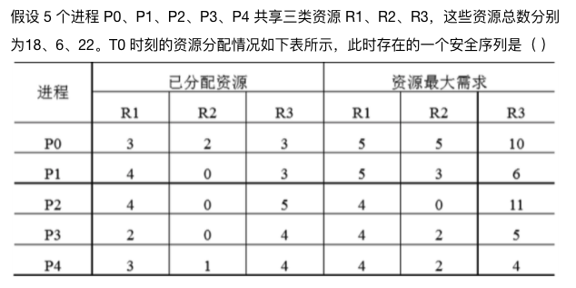

# 操作系统期中考试

## 选择题

### 1. 【单选】（2 分）具有对外部输入的信息能在规定时限内处理完毕并做出迅速反应的 OS 是（ ）

- [ ] A. 分时操作系统
- [ ] B. 批处理操作系统
- [ ] C. 实时操作系统
- [ ] D. 多处理机操作系统

### 2. 【单选】（2 分）内部异常（内中断）可分为故障（fault）、陷阱（trap）和终止（abort）三类。下列有关内部异常的叙述中，错误的（ ）

- [ ] ‌A. 内部异常的产生与当前执行指令相关
- [ ] B. 内部异常的检测由 CPU 内部逻辑实现
- [ ] C. 内部异常的响应发生在指令执行过程中
- [ ] D. 内部异常处理后返回到发生异常的指令继续执行

### 3. 【单选】（2 分）设有 3 个作业，其运行时间分别是 2、5、3 小时，假定它们同时到达，并在同一台处理器上以单道方式运行，则平均周转时间最小的执行序列是（ ）

- [ ] A. $J_1、J_2、J_3$
- [ ] B. $J_3、J_2、J_1$
- [ ] C. $J_2、J_1、J_3$
- [ ] D. $J_1、J_3、J_2$

### 4. 【单选】（2 分）设与某资源关联的信号量初值为 3，当前值为 1。若 $M$ 表示该资源的可用个数，$N$ 表示等待该资源的进程数，则 $M、N$ 分别是（ ）

- [ ] A. $0、1$
- [ ] B. $1、0$
- [ ] C. $1、2$
- [ ] D. $2、0$

### 5. 【单选】（2 分）三个进程共享四个同类资源，这些资源的分配与释放只能一次一个。已知每一个进程最多需要两个该类资源，则该系统（ ）

- [ ] A. 有某进程可能永远得不到该类资源
- [ ] B. 必然死锁
- [ ] C. 进程请求该类资源立刻能得到
- [ ] D. 必然无死锁

### 6. 【单选】（2 分）
‎

- [ ] A. $P_0, P_2, P_4, P_1, P_3$ 
- [ ] B. $P_1, P_0, P_3, P_4, P_2$
- [ ] C. $P_2, P_1, P_0, P_3, P_4$  
- [ ] D. $P_3, P_4, P_2, P_1, P_0$

### 7. 【单选】（2 分）存储器的段页式管理中，每次从主存中取出一条指令或一个操作数，需要（ ）次访问主存

- [ ] A. 1
- [ ] B. 2
- [ ] C. 3
- [ ] D. 4

### 8. 【单选】（2 分）下列选项中，属于多级页表优点的是（ ）

- [ ] A. 加快地址变换速度
- [ ] B. 减少缺页中断次数 
- [ ] C. 减少页表项所占字节数
- [ ] D. 减少页表所占的连续内存空间

### 9. 【单选】（2 分）已知某计算机系统虚拟内存系统采用硬件支持的二级页表，页表项为 $64 bit$，页面大小为 $4 KB$，假设程序连续访问长度为 $1 MB$ 的数组且过程中未发生中断，那么这个过程中最多会访问多少次内存中的页表？（ ）

- [ ] A. 128
- [ ] B. 256
- [ ] C. 512
- [ ] D. 1024

### 10. 【单选】（2 分）在下列有关请求分页管理的叙述中，正确的是（ ）

- [ ] A. 程序和数据是在开始执行前一次性装入的
- [ ] B. 产生缺页中断一定要淘汰一个页面
- [ ] C. 一个淘汰的页面一定要写回外存
- [ ] D. 在页表中要有「状态位」、「访问位」等信息

## 应用题

### 1. （8 分）一个围棋盒中有若干黑子和白子，$A、B$ 和 $C$ 协作数围棋盒里的棋子数。$A$ 从盒子里取出黑子 `Getblack()` 并计数；$B$ 取出白子 `Getwhite()` 并计数。$C$ 在 $A$ 和 $B$ 计数完成后，将获得的黑子数和白子数合计，并用 `printf()` 显示黑子数、白子数和总数。要求每次从围棋盒中取出一个棋子（若已取完则取不到），且取出棋子动作要互斥，请使用信号量的 $P、V$ 操作描述 $A、B$ 和 $C$ 的互斥和同步，并说明所用信号量及初值的含义。

### 2. （7 分）假定系统为某进程分配了若干个物理块，对于该进程的页面的访问序列：$7，0，1，2，0，3，0，4，2，3，0，3，2，1，2，0，1，7，0，1$
‏
#### （1）若分配了 3 个物理块，则 FIFO、LRU、CLOCK 页面置换算法分别缺页多少次，缺页率是多少？

#### （2）若分配了 4 个物理块，则 FIFO、LRU、CLOCK 页面置换算法分别缺页多少次，缺页率是多少？
‏
#### （3）你发现了什么特点，并分析原因