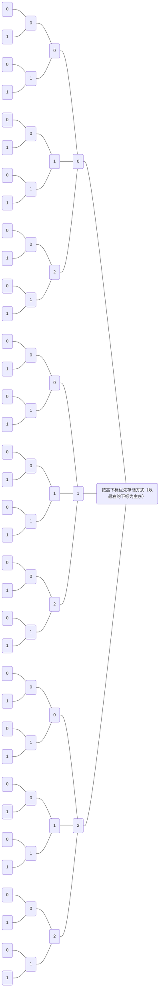

# 第 5 章 数组与广义表

## 一、基本内容

数组的类型定义和表示方式；特殊矩阵和稀疏矩阵的压缩存储方法及运算的实现；广义表的逻辑结构和存储结构、$m$ 元多项式的广义表表示以及广义表的操作的递归算法举例。

## 二、学习要点

1. 了解数组的两种存储表示方法，并掌握数组在以行为主的存储结构中的地址计算方法。
2. 掌握对特殊矩阵进行压缩存储时的下标变换公式。
3. 了解稀疏矩阵的两种压缩存储方法的特点和适用范围，领会以三元组表示稀疏矩阵时进行矩阵运算采用的处理方法。
4. 掌握广义表的结构特点及其存储表示方法，读者可根据自己的习惯，熟练掌握任意一种结构的链表，学会对非空广义表进行分解的两种分析方法：即可将一个非空广义表分解为表头和表尾两部分或者分解为 $n$ 个子表。
5. 学习利用分治法的算法设计思想编制递归算法的方法。在下列这组习题中，第一类习题对应教科书5.1和5.2节C语言风格的数组存储分配和元素地址计算（各维下界为 0）；第二类习题是推导特殊矩阵实现各种压缩存储时的下标变换公式；第三类习题涉及稀疏矩阵的各种压缩存储方法；第四类习题帮助读者熟悉广义表的存储结构和表头、表尾的分析方法；第五类习题则是为学习编写递归算法而安排的。

## 三、算法演示内容

在 DSDEMO 系统的选单「广义表」下，有以下算法演示：

- 求广义表的深度（`Ls_Depth`）；
- 复制广义表（`Ls_Copy`）；
- 遍历广义表（`Ls_Mark`）；
- 建立广义表的存储结构（`Crt_Lists`）。

## 四、基础知识题

### 5.1① 假设有二维数组 $A_{6 \times 8}$，每个元素用相邻的 6 个字节存储，存储器按字节编址。已知 `A` 的起始存储位置（基地址）为 `1000`，计算：

#### （1）数组 `A` 的体积（即存储量）；

$6 \times 8 \times 6 = 288 (Byte)$。

#### （2）数组 `A` 的最后一个元素 $a_{57}$ 的第一个字节的地址；

$1000 + (6 \times 8 - 1) \times 6 = 1282$。

#### （3）按行存储时，元素 $a_{14}$ 的第一个字节的地址；

$1000 + (2 \times 8 + 4) \times 6 = 1120$。

#### （4）按列存储时，元素 $a_{47}$ 的第一个字节的地址。

$1000 + (7 \times 6 + 4) \times 6 = 1276$。

### 5.2① 假设按低下标优先存储整数数组 $A_{9 \times 3 \times 5 \times 8}$时，第一个元素的字节地址是 `100`，每个整数占四个字节。问下列元素的存储地址是什么？

#### （1）$a_{0000}$

$100$。

#### （2）$a_{1111}$

$100 + (1 \times 3 \times 5 \times 8 + 1 \times 5 \times 8 + 1 \times 8 + 1) \times 4 = 776$。

#### （3）$a_{3125}$

$100 + (3 \times 3 \times 5 \times 8 + 1 \times 5 \times 8 + 2 \times 8 + 5) \times 4 = 1784$。

#### （4）$a_{8247}$

$100 + (8 \times 3 \times 5 \times 8 + 2 \times 5 \times 8 + 4 \times 8 + 7) \times 4 = 4416$。

### 5.3① 按高下标优先存储方式（以最右的下标为主序），顺序列出数组 $A_{2 \times 2 \times 3 \times 3}$ 中所有元素 $a_{ijkl}$，为了简化表达，可以只列出 $(i, j, k, l)$ 的序列。

$$
\begin{array}{llll}
(0, 0, 0, 0), (1, 0, 0, 0), (0, 1, 0, 0), (1, 1, 0, 0), \\
(0, 0, 1, 0), (1, 0, 1, 0), (0, 1, 1, 0), (1, 1, 1, 0), \\
(0, 0, 2, 0), (1, 0, 2, 0), (0, 1, 2, 0), (1, 1, 2, 0), \\
\\
(0, 0, 0, 1), (1, 0, 0, 1), (0, 1, 0, 1), (1, 1, 0, 1), \\
(0, 0, 1, 1), (1, 0, 1, 1), (0, 1, 1, 1), (1, 1, 1, 1), \\
(0, 0, 2, 1), (1, 0, 2, 1), (0, 1, 2, 1), (1, 1, 2, 1), \\
\\
(0, 0, 0, 2), (1, 0, 0, 2), (0, 1, 0, 2), (1, 1, 0, 2), \\
(0, 0, 1, 2), (1, 0, 1, 2), (0, 1, 1, 2), (1, 1, 1, 2), \\
(0, 0, 2, 2), (1, 0, 2, 2), (0, 1, 2, 2), (1, 1, 2, 2)。
\end{array}
$$

### 5.4① 将教科书 5.3.1 节中的式（5-3）改写为一个等式的形式。

$k = {\frac{max(i, j)[max(i, j) - 1]}{2} + min(i, j) - 1}$。

### 5.5③ 设有上三角矩阵 $(a_{ij})_{n \times n}$，，将其上三角元素逐行存于数组 `B[m]` 中（`m` 充分大），使得 $B[k] = a_{ij}$ 且 $k = f_1(i) + f_2(j) + c。试推导出函数 $f_1, f_2$ 和常数 $c$（要求 $f_1$ 和 $f_2$ 中不含常数项）。

$k = \frac{(2n + 1 - i)i}{2} + (j - i)$，故

### 5.6② 设有三对角矩阵 $(a_{ij})_{n \times n}$，将其三条对角线上的元素存于数组 `B[3][n]` 中，使得元素 $B[u][v] = a_{ij}$，试推导出从 $(i, j)$ 到 $(u, v)$ 的下标变换公式。

### 5.7③ 设有三对角矩阵 $(a_{ij})_{n \times n}$，将其三条对角线上的元素逐行地存于数组 `B[3n - 2]` 中，使得 $B[k] = a_{ij}$，求：

#### （1）用 $i, j$ 表示 $k$ 的下标变换公式；

#### （2）用 $k$ 表示 $i, j$ 的下标变换公式。

### 5.8③ 假设一个准对角矩阵

$$
\left[\begin{array}{cccc}
a_{11} & a_{12}\\
a_{21} & a_{22}\\
 & & a_{33} & a_{34}\\
 & & a_{43} & a_{44}\\
 & & & & \cdots\\
 & & & & & a_{i, j}\\
 & & & & & & \cdots\\
 & & & & & & & a_{2m - 1,2m - 1} & a_{2m - 1，2m}\\
 & & & & & & & a_{2m, 2m - 1} & a_{2m, 2m}
\end{array}\right]
$$

### 按以下方式存于一维数组 `B[4m]` 中：

|    0     |    1     |    2     |    3     |    4     |    5     |    6     | $\cdots$ |    k     | $\cdots$ |      4m - 3      |      4m - 2      |    4m - 1    |
| :------: | :------: | :------: | :------: | :------: | :------: | :------: | :------: | :------: | :------: | :--------------: | :--------------: | :----------: |
| $a_{11}$ | $a_{12}$ | $a_{21}$ | $a_{22}$ | $a_{33}$ | $a_{34}$ | $a_{43}$ | $\cdots$ | $a_{ij}$ | $\cdots$ | $a_{2m - 1, 2m}$ | $a_{2m, 2m - 1}$ | $a_{2m, 2m}$ |

### 写出由一对下标 $(i, j)$ 求 $k$ 的转换公式。

$$
k = \begin{cases}
    i + j - 2 & i 为奇数\\
    i + j - 1 & i 为偶数
\end{cases} 合并成一个公式，可写成 \begin{array}{cccc}
    k = i + j - (i \% 2) - 1\\
    或\\
    k = 2(i \space div \space 2) + j - 1
\end{array}。
$$

### 5.9② 已知 $A$ 为稀疏矩阵，试从空间和时间角度比较采用两种不同的存储结构（二