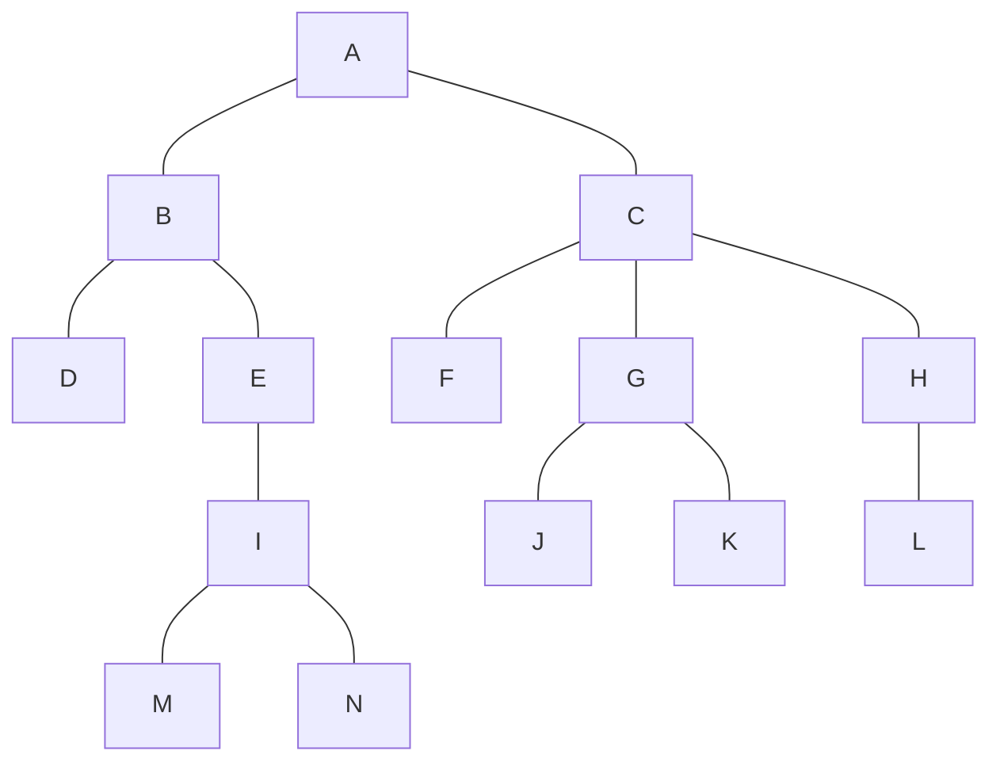

# 第 6 章 树和二叉树

## 一、基本内容

二叉树的定义、性质和存储结构；二叉树的遍历和线索化以及遍历算法的各种描述形式；树和森林的定义、存储结构与二叉树的转换、遍历；树的多种应用。本章是课程的重点内容之一。

## 二、学习要点

1. 熟练掌握二叉树的结构特性，了解相应的证明方法。
2. 熟悉二叉树的各种存储结构的特点及适用范围。
3. 遍历二叉树是二叉树各种操作的基础。实现二叉树遍历的具体算法与所采用的存储结构有关。不仅要熟练掌握各种遍历策略的递归和非递归算法，了解遍历过程中「栈」的作用和状态，而且能灵活运用遍历算法实现二叉树的其他操作。层次遍历是按另一种搜索策略进行的遍历。
4. 理解二叉树线索化的实质是建立结点与其在相应序列中的前驱或后继之间的直接联系，熟练掌握二叉树的线索化过程以及在中序线索化树上找给定结点的前驱和后继的方法。二叉树的线索化过程是基于对二叉树进行遍历，而线索二叉树上的线索又为相应的遍历提供了方便。
5. 熟悉树的各种存储结构及其特点，掌握树和森林与二叉树的转换方法。建立存储结构是进行其他操作的前提，因此读者应掌握1至2种建立二叉树和树的存储结构的方法。
6. 学会编写实现树的各种操作的算法。
7. 了解最优树的特性，掌握建立最优树和哈夫曼编码的方法。
8. 理解前序序列和中序序列可唯一确定一棵二叉树的道理，理解具有相同的前序序列而中序序列不同的二叉树的数目与序列 $1 2 \cdots n$ 按不同顺序进栈和出栈所能得到的排列的数目相等的道理，掌握由前序序列和中序序列建立二叉树的存储结构的方法。

本章内容较多，又是课程的重点，因此相应的练习题也较多。其中 6.1 至 6.32 题为基础知识和讨论题，6.33 至 6.76 题是算法设计题。算法设计题大体分为四类：6.33 至 6.55 题涉及二叉树的遍历以及通过遍历实现二叉树的其他操作；6.56 至 6.58 题涉及二叉树的线索化和在线索二叉树上找给定结点的前驱和后继；6.59至6.64题涉及树的遍历；6.65 至 6.76 题涉及树及二叉树的各种构造和输出操作。

## 三、算法演示内容

在 DSDEMO 系统的选单「二叉树」下，有以下算法演示：

- 遍历二又树
  - 先序遍历（`Pre_order`）
  - 中序遍历（`In_order`)
  - 后序遍历（`Post_order`）；
- 线索二叉树
  - 二叉树的线索化
    - 生成先序线索（前驱或后继）（`Pre_thre`）
    - 中序线索（前驱或后继）（`In_thre`）
    - 后序线索（前驱或后继）（`Post_thre`）；
  - 在线索树上插入一棵左子树（`Ins_lchild`）和删除一棵左子树（`Del_lchild`)；
- 应用问题
  - 建立表达式树（`Crt_exptree`）
  - 按先序序列和后序序列生成一棵二叉树（`BT_PreIn`）
  - 从森林转换成二叉树或从二叉树转换成森林
  - 生成哈夫曼树（`Get_HTree`）
  - 求得哈夫曼编码（`Get_HCode`）。

## 四、基础知识题

### 6.1① 已知一棵树边的集合为 $\{ <I, M>, <I, N>, <E, I>, <B, E>, <B, D>, <A, B>, <G, J>, <G, K>, <C, G>, <C, F>, <H, L>, <C, H>, <A, C> \}$，请画出这棵树，并回答下列问题：



#### （1）哪个是根结点？

A。

#### （2）哪些是叶子结点？

D、F、J、K、L、M、N。

#### （3）哪个是结点 G 的双亲？

C。

#### （4）哪些是结点 G 的祖先？

A、C。

#### （5）哪些是结点 G 的孩子？

J、K。

#### （6）哪些是结点 E 的子孙？

I、M、N。

#### （7）哪些是结点 E 的兄弟？哪些是结点 F 的兄弟？

D；G、H。

#### （8）结点 B 和 N 的层次号分别是什么？

2 和 5。

#### （9）树的深度是多少？

5。

#### （10）以结点 C 为根的子树的深度是多少？

3。

### 6.2① 一棵度为 2 的树与一棵二叉树有何区别？

- 度为 2 的树至少有 3 个节点，而二叉树可以为空。
- 度为 2 的有序树的孩子的左右次序是相对于另一孩子而言的，若某节点只有一个孩子，则这个孩子就无需区分其左右次序，而二叉树无论其孩子数是否为 2，均需确定其左右次序，即二叉树的结点次序不是相对于另一结点而言，而是确定的。 

### 6.3① 试分别画出具有 3 个结点的树和 3 个结点的二叉树的所有不同形态。


### 6.4③ 一棵深度为 $H$ 的满 $k$ 叉树有如下性质：第 $H$ 层上的结点都是叶子结点，其余各层上每个结点都有 $k$ 棵非空子树。如果按层次顺序从 1 开始对全部结点编号，问：

#### （1）各层的结点数目是多少？

$3^{k - 1}$。

#### （2）编号为 $p$ 的结点的父结点（若存在）的编号是多少？

$[p / k + 1 / 2]$。

#### （3）编号为 $p$ 的结点的第 $i$ 个儿子结点（若存在）的编号是多少？

$p \times k - [k + 1 / 2] + i$。

#### （4）编号为 $p$ 的结点有右兄弟的条件是什么？其右兄弟的编号是多少？

### 6.5② 已知一棵度为 $k$ 的树中有 $n_1$ 个度为 1 的结点，$n_2$ 个度为 2 的结点，……，$n_k$ 个度为 $k$ 的结点，问该树中有多少个叶子结点？

### 6.6③ 已知在一棵含有 $n$ 个结点的树中，只有度为 $k$ 的分支结点和度为 0 的叶子结点。试求该树含有的叶子结点的数目。

### 6.7③ 一棵含有 $n$ 个结点的 $k$ 叉树，可能达到的最大深度和最小深度各为多少？

可能达到的最大深度为 $n$，最小深度为 $1 + \log_{k}n$。

### 6.8① 证明：一棵满 $k$ 叉树上的叶子结点数 $n_0$ 和非叶子结点数 $n_1$ 之间满足以下关系：

$$
n_0 = (k - 1) n_1 + 1
$$

### 6.9② 试分别推导含 $n$ 个结点和含 $n_0$ 个叶子结点的完全三叉树的深度 $H$。

含 $n$ 个结点的完全三叉树的深度 $H = \log_3{n} + 1$；含 $n_0$ 个叶子结点的完全三叉树的深度 $H = n_0$

### 6.10① 对于那些所有非叶子结点均有非空左右子树的二叉树：

#### （1）试问：有 $n$ 个叶子结点的树中共有多少个结点？

#### （2）试证明：$\sum\limits_{i = 1}^{n}2^{-(l_i - 1)}=1$，其中 $n$ 为叶子结点的个数，$l_i$ 表示第 $i$ 个叶子结点所在的层次（设根结点所在层次为 1）。

### 6.11③ 在二叉树的顺序存储结构中，实际上隐含着双亲的信息，因此可和三叉链表对应。假设每个指针域占 4 个字节的存储，每个信息域占 $k$ 个字节的存储。试问：对于一棵有 $n$ 个结点的二叉树，且在顺序存储结构中最后一个结点的下标为 $m$，在什么条件下顺序存储结构比三叉链表更节省空间？

### 6.12② 对题 6.3 所得各种形态的二叉树，分别写出前序、中序和后序遍历的序列。

### 6.13② 假设 $n$ 和 $m$ 为二叉树中两结点，用「1」、「0」或「φ」（分别表示肯定、恰恰相反或者不一定）填写下表：

|       ---       | 前序遍历时n在m前? | 中序遍历时n在m前? | 后序遍历时n在m前? |
| :-------------: | :---------------: | :---------------: | :---------------: |
| $n$ 在 $m$ 左方 |         1         |         1         |         1         |
| $n$ 在 $m$ 右方 |         0         |         0         |         0         |
| $n$ 是 $m$ 祖先 |         1         |         φ         |         φ         |
| $n$ 是 $m$ 子孙 |         1         |         φ         |         φ         |

> 注：如果 ① 离 a 和 b 最近的共同祖先 p 存在，且 ② a 在 p 的左子树中，b 在 p 的右子树中，则称 a 在 b 的左方（即 b 在 a 的右方）。

### 6.14② 找出所有满足下列条件的二叉树：

#### （a）它们在先序遍历和中序遍历时，得到的结点访问序列相同；


#### （b）它们在后序遍历和中序遍历时，得到的结点访问序列相同；


#### （c）它们在先序遍历和后序遍历时，得到的结点访问序列相同；

```mermaid
graph TB

```

### 6.15② 请对右图所示二叉树进行后序线索化，为每个空指针建立相应的前驱或后继线索。


