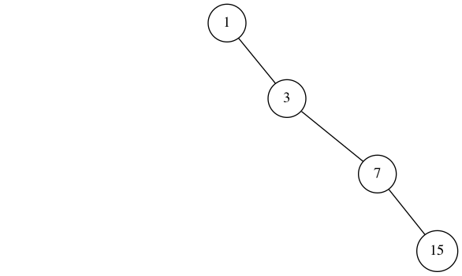
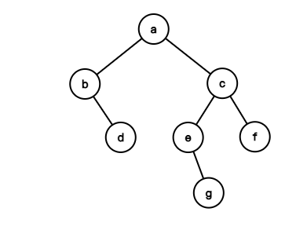
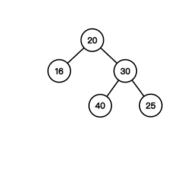
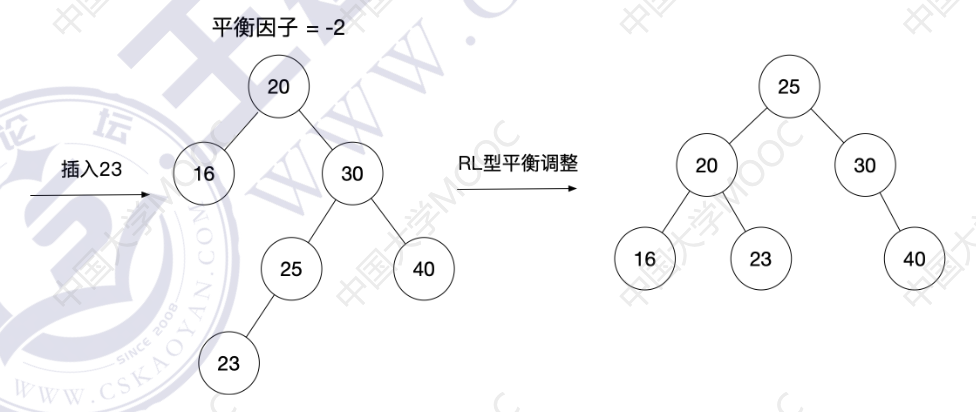
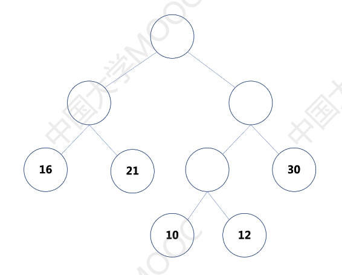
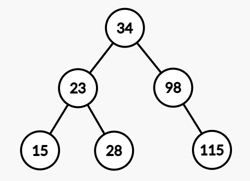
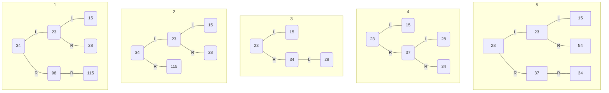

# 数据结构期中考试

## 单项选择题

### 1. 【单选】（5 分）下列程序段的时间复杂度是（ ）

```cpp
x = 91;
y = 1;
while (y < n) {
    if (x > 100) {
        x = x - 10;
        y = 2 * y;
    } else {
        x++;
    }
}
```

- [ ] A. $O(1)$
- [x] B. $O(\log_2 n)$
- [ ] C. $O(n^{\frac{1}{2}})$
- [ ] D. $O(n)$

> 参考答案：B
> 
> 本题要求具备一定的代码阅读能力。`x` 的初值为 91，每执行 10 次 `x++`，就执行一次 `y = 2 * y`，且 `x` 恢复为初值 91。也就是说，每 11 次循环，会导致 `y = 2 * y`。当 $y \ge n$ 时停止 `while` 循环，因此时间复杂度为 $O(11 \log_2 n) = O(log_2 n)$。

### 2. 【单选】（5 分）使⽤栈 `S` 进⾏括号匹配，括号序列为 `{{}([()]()[])}`，则栈 `S` 的容量⾄少是（ ）

- [ ] A. 2
- [ ] B. 3
- [x] C. 4
- [ ] D. 5

> 参考答案：C
> 
> 括号匹配的过程中，扫描到左括号，则入栈，扫描到右括号，则弹出栈顶左括号，并与右括号进行匹配。栈 `S` 的变化如下：
> 
> ① `{` 入栈，② `{` 入栈，③ `{` 出栈，④ `(` 入栈，⑤ `[` 入栈，⑥ `(` 入栈，⑦ `(` 出栈，⑧ `[` 出栈，⑨ `(` 入栈，⑩ `(` 出栈，⑪ `[` 入栈，⑫ `[` 出栈， ⑬ `(` 出栈，⑭ `{` 出栈
> 
> 当运行到第 ⑥ 步时，栈内元素最多，共 4 个，因此栈的大小至少为 4

### 3. 【单选】（5 分）有一个 10 阶的三对角矩阵  $M$，其元素 $M_{i, j} (1 \le i, j \le 10)$ 按列优先依次压缩存入下标从 0 开始的一位数组 `A` 中。则 `A[20]` 对应的元素是（ ）

- [ ] A. $M_{7, 7}$
- [ ] B. $M_{8, 8}$
- [ ] C. $M_{8, 7}$
- [x] D. $M_{7, 8}$

> 参考答案：D
> 
> 三对角矩阵按列优先方式压缩存储。`A[20]` 是第 21 个元素。三对角矩阵的前 7 列共 $2 + 3 \times 6 = 20$ 个元素。因此第 21 个元素刚好是第八列的第一个元素，即 $M_{7, 8}$
> 
> 咸鱼注：抱歉抱歉，第一次使用 MOOC 在线考试系统，MOOC 上选错了正确答案为 B，我自罚一杯奶茶。

### 4. 【单选】（5 分）⼆叉树 $T$ 共有 4 个结点，若采⽤顺序存储结构保存，每个结点占 1 个存储单元，则存放该⼆叉树需要的存储单元数量最多是（ ）

- [ ] A. 4
- [ ] B. 7
- [ ] C. 8
- [x] D. 15

> 参考答案：D
> 
> 二叉树的顺序存储，需要将结点与「完全二叉树」对应。当每个分支结点都只有右孩子时，所需要的存储单元数量最多。二叉树的形态如下：
> 
> 
> 
> 此题可以利用完全二叉树结点编号之间的关系来推导，对于一棵完全二叉树，若根节点编号从 1 开始，则每个分支节点 $i$ 的右孩子编号为 $2i + 1$。 由此可得，最下层的叶子结点对应完全二叉树的结点编号为 15。因此，该二叉树需要的存储单元数量最多是 15。
> 
> 当然，也可以用另一个思路来计算，$h$ 层的满二叉树有总共有 $2h - 1$ 个结点，因此四层满二叉树
总共有 15 个结点。

### 5. 【单选】（5 分）某森林 `F` 对应的⼆叉树为 `T`，若 `T` 的先序遍历序列是 `a, b, d, c, e, g, f`，中序遍历序列是 `b, d, a, e, g, c, f`，则 `F` 中树的棵数是（ ）

- [ ] A. 1
- [ ] B. 2
- [x] C. 3
- [ ] D. 4

> 参考答案：C
> 
> 由于二叉树的前序遍历和中序遍历序列能确定唯一的一棵二叉树，因此本题可以确定二叉树 `T` 的结构。
> 
> 
> 
> 逐层断掉 `T` 中最右侧的右子树，即可得到三棵树，因此森林 `F` 中树的棵数是 3。

### 6. 【单选】（5 分）给定平衡二叉树如下图所示，插入关键字 23 后根结点中的关键字是（ ）



- [ ] A. 16
- [ ] B. 20
- [ ] C. 23
- [x] D. 25

> 参考答案：D
> 
> 将关键字 23 插入作为关键字25所在结点的左孩子后，该二叉树失衡，经过平衡调整后，该平衡二叉树变为如下图所示结构，根节点中的关键字为 25。
> 
> 

### 7. 【单选】（5 分）若某⼆叉树有 5 个叶⼦结点，其权值分别为 10，12，16，21，30。则其最⼩的带权路径⻓度（WPL）是（ ）

- [ ] A. 89
- [x] B. 200
- [ ] C. 208
- [ ] D. 289

> 参考答案：B
> 
> 要求最小的 WPL，即考查哈夫曼树的构造，构造结果如下图所示，因此 $WPL = 2 \times (16 + 21 + 30) + 3 \times (10 + 12) = 200$。
> 
> 

### 8. 【单选】（5 分）对于 $n (n \ge 2)$ 个字符构造的⼆叉哈夫曼树，每个字符结点的权值都⼤于 0 （但各节点权值可能相等）。则下列叙述错误的是 ( )

- [x] A. 树中两个权值最⼩的结点⼀定是兄弟结点
- [ ] B. 该哈夫曼树的最⼤⾼度是 $n$
- [ ] C. 该哈夫曼树的结点总数为 $2n - 1$ 
- [ ] D. 所有⾮叶结点的权值之和不⼩于所有叶结点的权值之和

> 参考答案：A
> 
> A 选项：该选项不严谨，若各个字符结点的权值都为 1，则所有的结点都是「权值最小的结点」，但不一定都是兄弟。
> 
> B 选项：根据哈夫曼树的构造过程，包含 $n$ 个叶结点的哈夫曼树，最大高度为 $n$。
> 
> C 选项：二叉哈夫曼树中，只有度为 2 和度为 0 的结点。度为 0 的结点数为 $n$，假设度为 2 的结点数为 $m$，则 $2m + 1 = m + n$，即 $m = n - 1$。因此该哈夫曼树的结点总数为 $2n - 1$。
> 
> D 选项：根据哈夫曼树的构造过程可知，单独一个根节点的权值，就等于所有叶子结点的权值之和，再加上其他非叶结点的权值，一定大于所有叶子结点的权值之和。

### 9. 【单选】（5 分）采用 KMP 算法进行模式匹配。主串 $S = 'ABCABCDABABCDABCDABDE'$，模式串$T = 'ABCDABD'$。当第三次发生「失配」（`S[j] != T[j]`) 时，单个字符间的累计比较次数是 ( )

- [ ] A. 14
- [ ] B. 13
- [x] C. 12
- [ ] D. 6

> 参考答案：C
> 
> 处理这个题目，并不需要求 `next` 数组，发生失配的时候，模式串往后滑就行。可以快速做题
> 
> S = '**ABCA**BCDABABCDABCDABDE'  
> T = '**ABCD**ABD'`
> 
> 第一次发生失配，累计比较了 4 次字符
> 
> S = 'ABC**ABCDABA**BCDABCDABDE'  
> T = &emsp;&emsp;'**ABCDABD**'
> 
> 第二次发生失配，累计比较了 $4 + 7$ 次字符
> 
> S = 'ABCABCD**ABA**BCDABCDABDE'  
> T = &emsp;&emsp;&emsp;&emsp;&ensp;'**ABC**DABD'
> 
> 第三次发生失配，累计比较了 $4 + 7 + 1$ 次字符，即累计对比 12 次
> 
> 咸鱼注：这个题目录入的时候也打错了，再自罚一杯，对不起！

### 10. 【单选】（5 分）在⼀棵⾼度为 3、阶数为 3 的 B 树中，根为第⼀层，若第⼆层有 4 个关键字，则该树的结点个数最多是（ ）

- [x] A. 11
- [ ] B. 10
- [ ] C. 9
- [ ] D. 8

> 参考答案：A
> 
> 阶数为 3 的 B 树中，每个结点包含的关键字可以为 1 个或 2 个。本题中，要求第二层有 4 个关键字，则结点数最多的情况如下图所示，其中 A、B、C、D……表示关键字，最多可能有 11 个结点。
> 
> ```mermaid
> graph TB
> 1[A B] --> 2[C D]
> 1 --> 3[E]
> 1 --> 4[F]
> 2 --> 5[G]
> 2 --> 6[H]
> 2 --> 7[I]
> 3 --> 8[J]
> 3 --> 9[K]
> 4 --> 10[L]
> 4 --> 11[M]
> ```

### 11. 【单选】（5 分）已知初始为空的队列 `Q` 的⼀端能进⾏⼊队操作⼜能进⾏出队操作，另⼀端只能进⾏⼊队操作。若 `a` 的⼊队序列是 1，2，3，4，5。则不能得到的出队序列是（ ）

- [ ] A. 5，4，3，1，2
- [ ] B. 5，3，1，2，4
- [ ] C. 4，2，1，3，5
- [x] D. 4，1，3，2，5

> 参考答案：D
> 
> 题目应是一种输出受限的双端队列，因此根据选项 C 和 D，若 4 是第一个出队的元素，那么至少 1、2、3、4 已全部入队，则队列中 2 应该与 1 相邻，出队时顺序也应该相邻，所以选项 D 错误。

## 综合应用题

### 1. 字符串 `S` 的长度为 `n`，`S` 中的字符 `S[i]` 满足 `'A' <= S[i] <= 'Z'`，请设计一个时间上尽可能高效的算法，统计 `S` 中有多少个不同的字母。要求：

#### （1）给出算法的基本设计思想。（6 分）

可以使用一个数组 `a[26]` 保存 `A`～`Z` 是否出现过，`0` 表示已经未出现过，`>0` 表示出现过。扫描字符串 `S`，更新数组 `a`。然后用 `num` 统计有多少个不同的字母出现。

#### （2）根据设计思想，采用 C 或 C++ 语言描述算法，关键之处给出注释。（10 分）

```cpp
int ans(char S[], int n) {
    int j, a[26] = {};
    int num = 0; // num 统计有几个不同的字母出现
    for (int i = 0; i < n; i++) { // 扫描串 S
        j = S[i] - 'A'; // j 表示是 A 开始的第几个字母，A 是第 0 个
        a[j]++;
    }
    for (int i = 0; i < 26; i++) { // 统计
        if (a[i] != 0) {
            num++;
        }
    }
    return num;
}
```

#### （3）说明你所设计的算法的时间复杂度。

空间复杂度主要是数组 `a[26]`，是常数所以是 $O(1)$。时间复杂度主要是两个循环，一个循环 $n$ 次，一个循环 26 次，所以是 $O(n)$。

### 2、对于一棵非空平衡二叉树，其中任何一个节点的平衡因子只为 -1、0、1（平衡因子 = 左子树的高度 - 右子树的高度）

#### （1）请写出二叉树的结点定义（`data` 域是 `int`）。

```cpp
typedef struct BiTNode {
    int data;
    struct BiTNode *lchild, *rchild;
} BiTNode, *BiTree;

typedef struct AVLNode {
    int key;
    struct AVLNode *lchild, *rchild;
} AVLNode, *AVLTree;
```

#### （2）设 $a[h]$ 表示满足高为 $h$ 的平衡二叉树的最小节点数。$h = 1$ 时，只有根节点，$a[1] = 1$；$h = 2$ 时，$a[2] = 2$。请推导出 $a[h]$ 的递推关系式。

$$
a[h] = \begin{cases}
h & h = 1, 2\\ 
a[h - 1] + a[h - 2] + 1 & h \ge 3
\end{cases}
$$

#### （3）对于下面这颗平衡二叉树，执行如下操作：删除 98，删除 115，插入37，插入 54。请分别画出每一步插入或者删除操作完成后的平衡二叉树。




