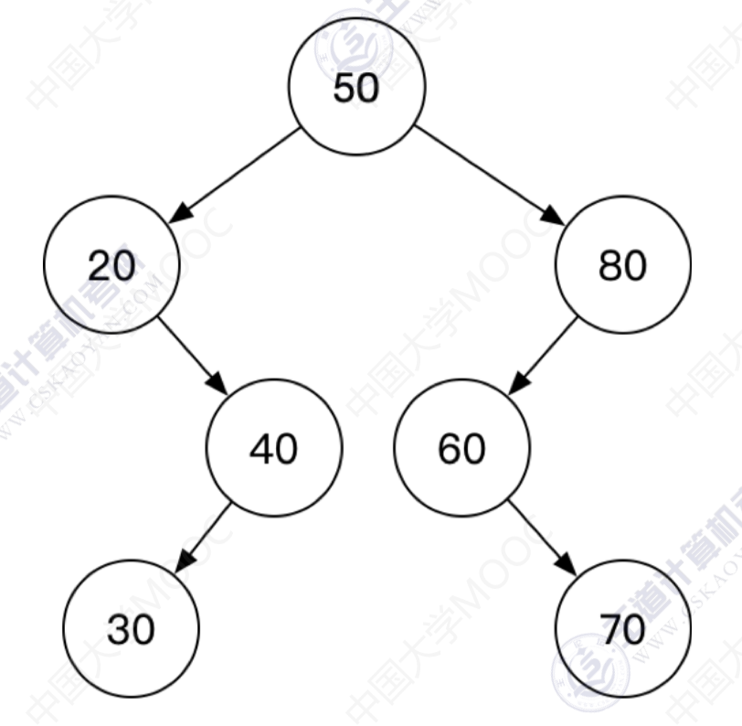
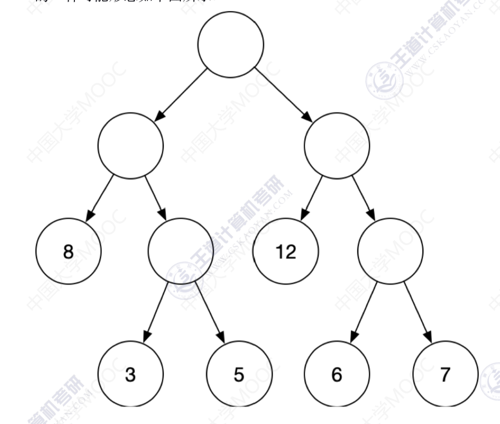
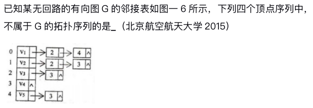
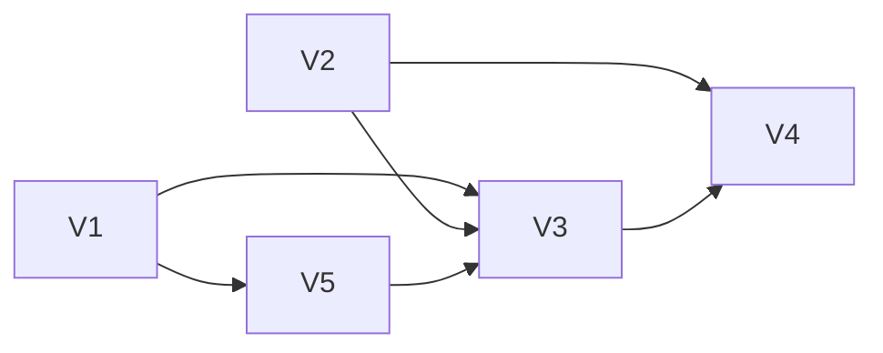
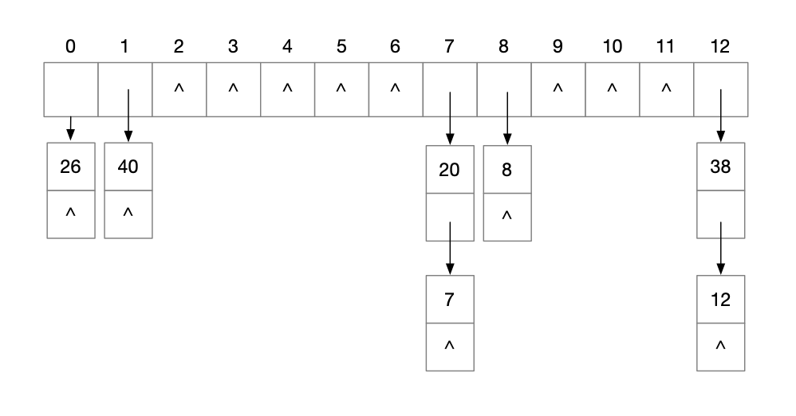

# 数据结构期末考试

## 选择题

### 1. 【单选】（5 分）下列叙述中正确的是（ ）

1. ‎线性表在链式存储时，查找第 $i$ 个元素的时间同 $i$ 的值成正比
2. 线性表在链式存储时，查找第 $i$ 个元素的时间同 $i$ 的值无关
3. 线性表在顺序存储时，查找第 $i$ 个元素的时间同 $i$ 的值成正比

- [x] A. 仅①
- [ ] B. 仅②
- [ ] C. 仅③
- [ ] D. ①②③

> 参考答案：A
> 
> 线性表在链式存储时，查找第 $i$ 个元素的时间同 $i$ 的值成正比。线性表在顺序存储时，查找第 $i$ 个元素的时间同 $i$ 的值无关。

### 2. 【单选】（5 分）若以 S 和 X 分别表示进栈和退栈操作，则对初始状态为空的栈可以进行的栈操作系列是（ ）

- [ ] A. SXSSXXXX
- [ ] B. SXXSXSSX
- [ ] C. SXSXXSSX
- [ ] D. SSSXXSXX

> 参考答案：D
> 
> 判断是否为合法的栈操作序列通常有两条规则，第一是给定序列中 S 的个数和 X 的个数相等；第二是从给定序列的开始，到给定序列中的任一位置，S 的个数要大于或等于 X 的个数。

### 3. 【单选】（5 分）已知一算术表达式的中缀形式为 `A+B*C-D/E`，后缀形式为 `ABC*+DE/-`，其前缀形式为（ ）

- [ ] ‎A. `-A+B*C/DE`
- [ ] B. `-A+B*CD/E`
- [ ] C. `-+*ABC/DE`
- [x] D. `-+A*BC/DE`

> 参考答案: D
> 
> 可将算术表达式的中缀形式作为一棵二叉树的中序遍历序列，将后缀形式作为这棵二叉树的后序遍历序列，再由二叉树的中序遍历序列和后序，遍历序列唯一的确定这棵二叉树，在对其进行先序遍历，就可得出算术表达式的前缀形式。

### 4. 【单选】（5 分）若有 18 个元素的有序表存放在一维数组 `A[19]`中，第一个元素放 `A[1]` 中，现进行二分查找，则查找 `A[3]` 的比较序列的下标依次为（ ）

- [ ] A. 1，2，3
- [ ] B. 9，5，2，3
- [ ] C. 9，5，3
- [x] D. 9，4，2，3

> 参考答案: D
> 
> 折半查找的基本思想是：首先以整个查找表作为查找范围，用查找条件中给定值 $k$ 与中间位置结点的关键字比较，若相等，则查找成功；否则，根据比较结果缩小查找范围，如果 $k$ 的值小于关键字的值，根据查找表的有序性可知查找的数据元素只有可能在表的前半部分，即在左半部分子表中，所以继续对左子表进行折半查找；若 $k$ 的值大于中间结点的关键字值，则可以判定查找的数据元素只有可能在表的后半部分，即在右半部分子表中，所以应该继续对右子表进行折半查找。每进行一次折半查找，要么查找成功，结束查找，要么将查找范围缩小一半，如此重复，直到查找成功或查找范围缩小为空即查找失败为止。既然是有序列第一个元素放 `A[1]` 中，现进行二分查找 $(1 + 18) / 2 = 9$，第一次为 `A[9]`，继续 $(1 + 8) /2 = 4$， 所以再查 `A[4]`，继续 $(1 + 3) / 2 = 2$，接着查 `A[2]`，继续 `low = high = A[3]`，所以查找到 `A[3]`。

### 5. 【单选】（5 分）若某二叉排序树的前序遍历序列为 `50, 20, 40, 30, 80, 60, 70`，则后序遍历序列为（ ）

- [ ] A. `30, 40, 20, 50, 70, 60, 80`
- [x] B. `30, 40, 20, 70, 60, 80, 50`
- [ ] C. `70, 60, 80, 50, 30, 40, 20`
- [ ] D. `70, 60, 80, 30, 40, 20, 50`

> 参考答案：B
> 
> 前序遍历序列为 `50, 20, 40, 30, 80, 60, 70`，说明根节点为 `50`，而在后序遍历序列中，根节点一定是出现在最后一个，因此排除 AC。另外，在二叉排序树中，左 < 根 < 右。根据前序遍历序列可知，根节点的左子树有 `20`、`40`、`30` 几个结点，右子树中有 `80`、`60`、`70` 几个结点，而后序遍历次序为左右中，因此 `20`、`40`、`30` 几个结点一定出现在 `80`、`60`、`70` 之前，因此可排除 D，选 B。  
> 当然，这一题完全可以根据前序遍历序列，结合二叉排序树的特性将这棵排序树画出来。形态如下：  

  

> 大家思考这样一个问题：如果给出二叉排序树的前序、中序、后序遍历中的一种，是否可以恢复这棵二叉排序树的形态呢？

### 6. 【单选】（5 分）分别以 6，3，8，12，5，7 对应叶结点的权值构造的哈夫曼树的深度为（ ）

- [ ] A. 6
- [ ] B. 5
- [x] C. 4
- [ ] D. 3

> 参考答案：C
> 
> 按照哈夫曼树构造方法手动模拟即可得答案。哈夫曼树的一种可能形态如下图所示：



### 7. 【单选】（5 分）若具有 $n$ 个定点的连通图采用邻接矩阵表示，则该矩阵中的非零元素至少是（ ）

- [x] A. $2(n - 1)$
- [ ] B. $n - 1$
- [ ] C. $n$
- [ ] D. $frac{n}{2}$

> 参考答案：A
> 
> 如果图中任意两点都是连通的，那么图被称作连通图。如果此图是有向图，则称为强连通图（注意：需要双向都有路径）。所谓连通图一定是无向图，有向的叫做强连通图。连通 $n$ 个顶点，至少只需要 $n - 1$ 条边就可以了，或者说就是生成树。由于无向图的每条边同时关联两个顶点，因此邻接矩阵中每条边被存储了两次（也就是说是对称矩阵），因此至少有 $2(n - 1)$ 个非零元素。

### 8. 【单选】（5 分）已知某无回路的有向图 G 的邻接表如图所示，下列四个顶点序列中，不属于 G 的拓扑序列的是（ ）（北京航空航天大学，2015）
 ‍

‏

- [ ] A. $V_1, V_2, V_3, V_5, V_4$
- [x] B. $V_1, V_2, V_3, V_4, V_5$
- [ ] C. $V_2, V_1, V_3, V_5, V_4$
- [ ] D. $V_2, V_1, V_5, V_3, V_4$

> 参考答案：B
> 
> 根据邻接表作出图 G 后，采用拓扑排序，B 选项中，$V_4$ 不能在 $V_5$ 之前。图的结构如下：



### 9. 【单选】（5 分）现有长度为 11 且初始为空的散列表 `HT`，散列函数是 `H(key) = key % 7`，采用线性探查（线性探测再散列）法解决冲突。将关键字序列 `87, 40, 30, 6, 11, 22, 98, 20` 依次插入 `HT` 后，`HT` 查找失败的平均查找长度是（ ）

- [ ] A. 4
- [ ] B. 5.25
- [x] C. 6
- [ ] D. 6.29

> 参考答案：C
> 
> 根据 `H(key) = key % 7` 可知，任何关键字在散列表中的位置只能是 0 ~ 6。那查找失败的步长就为关键字位置距离第一个地址上关键字为空的距离，所以总的失败步长为：$9 + 8 + 7 + 6 + 5 + 4 + 3 = 42$，平均：$42 / 7 = 6$，所以答案为 C。

### 10. 【单选】（5 分）若对序列 $(49, 38, 65, 97, 76, 13, 27, 49')$ 进行快速排序，则第一趟排序结束（即确定了第 1 个分界元素的最终位置）时，序列的状态是（ ）

- [ ] A. $(13, 27, 49', 38, 49, 76, 97, 65)$
- [ ] B. $(13, 38, 49', 27, 49, 97, 76, 65)$
- [ ] C. $(13, 38, 27, 49', 49, 76, 97, 65)$
- [x] D. $(27, 38, 13, 49, 76, 97, 65, 49’)$

> 参考答案：D
> 
> 快速排序的基本思想是：通过一趟排序将要排序的数据分割成独立的两部分，其中一部分的所有数据都比另外一部分的所有数据都要小，然后再按此方法对这两部分数据分别进行快速排序，整个排序过程可以递归进行，以此达到整个数据变成有序序列。手动模拟一次快速排序的过程即可得答案。  
> 快速排序有两种移动元素的方法，一种是交换式，一种是填坑式（严书用的填坑式），所谓填坑式就是，先令 `temp = a[0]`，然后挖去第一个元素 `a[0]` 留下一个坑，再从右往左找到第一个小于 ·temp· 的数，填入坑中，然后留下一个新坑，再从左往右找到第一个大于等于`temp` 的数，填入坑中并留下新坑，然后不断交替，直到左右指针相遇。  
> 题中 `temp = 49`

```cpp
<<< __ 38 65 97 76 13 27 49'
<<< 27 38 65 97 76 13 __ 49'
<<< 27 38 65 __ 76 13 97 49'
<<< 27 38 65 49 76 13 97 49'
```

### 11. 【单选】（5 分）若对序列 $(2, 12, 16, 70, 5, 10)$ 按值从小到大进行排序，前三趟排序的结果分别为：

- 第 1 趟排序的结果为：$(2, 12, 16, 5, 10, 70)$
- 第 2 趟排序的结果为：$(2, 12, 5, 10, 16, 70)$
- 第 3 趟排序的结果为：$(2, 5, 10, 12, 16, 70)$
​
### 由此可以断定，该排序过程采用的排序方法是（ ）

- [ ] A. 插入排序法
- [ ] B. 选择排序法
- [x] C. 冒泡排序法
- [ ] D. 快速排序法

> 参考答案：C
> 
> 对于此类题，先看备选项排序算法，在看排序过程中排序过程是否符合这一算法特征，挨个排除。  
> 插入排序的特点是：第 $i$ 趟排序后，前 $i + 1$ 个元素的相对顺序是正确的。  
> 选择排序的特点是：第 $i$ 趟排序后，最小的 1 个元素或最大的 $i$ 个元素，已经处于最终位置。  
> 冒泡排序的特点是：第 $i$ 趟排序后，最小的 $i$ 个元素或最大的 $i$ 个元素，已经处于最终位置。  
> 快速排序的特点是：第 $i$ 趟排序后，至少有 $i$ 个元素已经处于最终位置。  
> 结合各种排序算法的特征，可以快速排出一些选项，剩余的选项再带入排序算法的具体步骤进行验证。

## 应用题

### 1. （20 分）散列表的地址区间为 0 ~ 12，散列函数为 `H(key) = key % 13`，采用链地址法处理冲突，将关键码序列 `{20, 26, 7, 38, 8, 12, 40}` 依次存储到散列表中
‌
#### （1）（8 分）请画出所有关键码存储完后散列表的结构。
‌


#### （2）（6 分） 以相同概率从`{20, 26, 7, 38, 8, 12, 40}`中抽取关键码进行查找，计算查找成功的平均查找长度。
‌
$$
\frac{1}{7} \times (1 \times 5 + 2 \times 2) = \frac{9}{7}
$$

#### （3）（6 分）假设每个散列地址被查找概率相同，计算查找失败的平均查找长度。

$$
\frac{1}{13} \times (1 \times 8 + 2 \times 3 + 3 \times 2) = \frac{20}{13}
$$

### 2. （25 分）有一个数组 `A` 由 $n$ 个互不相同的正整数组成，该序列中的数先减后增，输入一个整数 `key`，判断该整数是否在该数组中。例如对应 `A = {10, 7, 5, 2, 6, 13, 15}`，`key = 5` 时返回 `true`，若`key = 8` 则返回 `false`。
‎
#### （1）（8 分）给出算法的基本设计思想。
‎
`for` 遍历一遍数组，求出是否有元素 `=key`

#### （2）（13 分）根据设计思想，采用 C 或 C++ 语言描述算法，关键之处给出注释。
‎
```cpp
bool ans(int A[], int n, int key) {
    for (int i = 0; i < n; i++) {
        if (A[i] == key) {
            return true;
        }
        return false;
    }
}
```

#### （3）（4 分）说明你所设计算法的时间复杂度和空间复杂度。

- 时间复杂度：$O(n)$；
- 空间复杂度：$O(1)$。