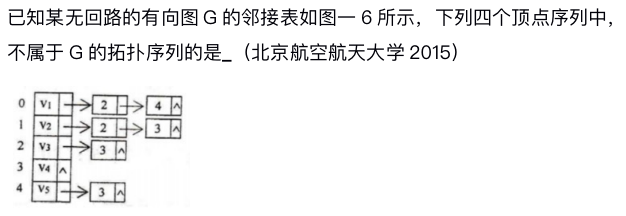

# 数据结构期末考试

## 选择题

### 1. 【单选】（5 分）下列叙述中正确的是（ ）

1. ‎线性表在链式存储时，查找第 i 个元素的时间同 i 的值成正比
2. 线性表在链式存储时，查找第 i 个元素的时间同 i 的值无关
3. 线性表在顺序存储时，查找第 i 个元素的时间同 i 的值成正比

- [ ] A. 仅①
- [ ] B. 仅②
- [ ] C. 仅③
- [ ] D. ①②③

### 2. 【单选】（5 分）若以 S 和 X 分别表示进栈和退栈操作，则对初始状态为空的栈可以进行的栈操作系列是（ ）

- [ ] A. SXSSXXXX
- [ ] B. SXXSXSSX
- [ ] C. SXSXXSSX
- [ ] D. SSSXXSXX

### 3. 【单选】（5 分）已知一算术表达式的中缀形式为 `A+B*C-D/E`，后缀形式为 `ABC*+DE/-`，其前缀形式为（ ）

- [ ] ‎A. `-A+B*C/DE`
- [ ] B. `-A+B*CD/E`
- [ ] C. `-+*ABC/DE`
- [ ] D. `-+A*BC/DE`

### 4. 【单选】（5 分）若有 18 个元素的有序表存放在一维数组 `A[19]`中，第一个元素放 `A[1]` 中，现进行二分查找，则查找 `A[3]` 的比较序列的下标依次为（ ）

- [ ] A. 1，2，3
- [ ] B. 9，5，2，3
- [ ] C. 9，5，3
- [ ] D. 9，4，2，3

### 5. 【单选】（5 分）若某二叉排序树的前序遍历序列为 `50, 20, 40, 30, 80, 60, 70`，则后序遍历序列为（ ）

- [ ] A. `30, 40, 20, 50, 70, 60, 80`
- [ ] B. `30, 40, 20, 70, 60, 80, 50`
- [ ] C. `70, 60, 80, 50, 30, 40, 20`
- [ ] D. `70, 60, 80, 30, 40, 20, 50`

### 6. 【单选】（5 分）分别以 6，3，8，12，5，7 对应叶结点的权值构造的哈夫曼树的深度为（ ）

- [ ] A. 6
- [ ] B. 5
- [ ] C. 4
- [ ] D. 3

### 7. 【单选】（5 分）若具有 $n$ 个定点的连通图采用邻接矩阵表示，则该矩阵中的非零元素至少是（ ）

- [ ] A. $2(n - 1)$
- [ ] B. $n - 1$
- [ ] C. $n$
- [ ] D. $frac{n}{2}$

### 8. 【单选】（5 分）已知某无回路的有向图 G 的邻接表如图所示，下列四个顶点序列中，不属于 G 的拓扑序列的是（ ）（北京航空航天大学，2015）
 ‍

‏

- [ ] A. $V_1, V_2, V_3, V_5, V_4$
- [ ] B. $V_1, V_2, V_3, V_4, V_5$
- [ ] C. $V_2, V_1, V_3, V_5, V_4$
- [ ] D. $V_2, V_1, V_5, V_3, V_4$

### 9. 【单选】（5 分）现有长度为 11 且初始为空的散列表 `HT`，散列函数是 `H(key) = key % 7`，采用线性探查（线性探测再散列）法解决冲突。将关键字序列 `87, 40, 30, 6, 11, 22, 98, 20` 依次插入 `HT` 后，`HT` 查找失败的平均查找长度是（ ）

- [ ] A. 4
- [ ] B. 5.25
- [ ] C. 6
- [ ] D. 6.29

### 10. 【单选】（5 分）若对序列 $(49, 38, 65, 97, 76, 13, 27, 49')$ 进行快速排序，则第一趟排序结束（即确定了第 1 个分界元素的最终位置）时，序列的状态是（ ）

- [ ] A. $(13, 27, 49', 38, 49, 76, 97, 65)$
- [ ] B. $(13, 38, 49', 27, 49, 97, 76, 65)$
- [ ] C. $(13, 38, 27, 49', 49, 76, 97, 65)$
- [ ] D. $(27, 38, 13, 49, 76, 97, 65, 49’)$

### 11. 【单选】（5 分）若对序列 $(2, 12, 16, 70, 5, 10)$ 按值从小到大进行排序，前三趟排序的结果分别为：

- 第 1 趟排序的结果为：$(2, 12, 16, 5, 10, 70)$
- 第 2 趟排序的结果为：$(2, 12, 5, 10, 16, 70)$
- 第 3 趟排序的结果为：$(2, 5, 10, 12, 16, 70)$
​
### 由此可以断定，该排序过程采用的排序方法是（ ）

- [ ] A. 插入排序法
- [ ] B. 选择排序法
- [ ] C. 冒泡排序法
- [ ] D. 快速排序法

## 应用题

### 1. （20 分）散列表的地址区间为 0 ~ 12，散列函数为 `H(key) = key % 13`，采用链地址法处理冲突，将关键码序列 `{20, 26, 7, 38, 8, 12, 40}` 依次存储到散列表中
‌
#### （1）（8 分）请画出所有关键码存储完后散列表的结构。
‌
#### （2）（6 分） 以相同概率从`{20, 26, 7, 38, 8, 12, 40}`中抽取关键码进行查找，计算查找成功的平均查找长度。
‌
#### （3）（6 分）假设每个散列地址被查找概率相同，计算查找失败的平均查找长度。

### 2. （25 分）有一个数组 `A` 由 $n$ 个互不相同的正整数组成，该序列中的数先减后增，输入一个整数 `key`，判断该整数是否在该数组中。例如对应 `A = {10, 7, 5, 2, 6, 13, 15}`，`key = 5` 时返回 `true`，若`key = 8` 则返回 `false`。
‎
#### （1）（8 分）给出算法的基本设计思想。
‎
#### （2）（13 分）根据设计思想，采用 C 或 C++ 语言描述算法，关键之处给出注释。
‎
#### （3）（4 分）说明你所设计算法的时间复杂度和空间复杂度。