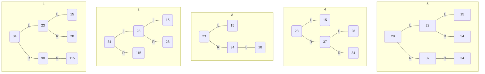

### 1、字符串 `S` 的长度为 `n`，`S` 中的字符 `S[i]` 满足 `'A' <= S[i] <= 'Z'`，请设计一个时间上尽可能高效的算法，统计 `S` 中有多少个不同的字母。要求：

#### （1）给出算法的基本设计思想。

建立 `occur[26]`，初始值为 0，当字母出现时，相应位置设为 1，遍历字符串，输出 `occur` 中 1 的个数。

#### （2）根据设计思想，采用 C 或 C++ 语言描述算法，关键之处给出注释。

```cpp
int occur[26]; // 建立数组表示字母是否出现，初始为 0
int alphabet(char *S, int n) {
    for (int i = 0; i < n; i++) { // 依序读入 S 中字符
        occur[(int) S[i] - 65] = 1; // 字母出现时，数组相应位置变为 1（'A' ~ 'Z' 的 ASCII 值为 65 ~ 90）
    }
    n = 0; // 初始化字母个数为 0
    for (int i = 0; i < 26; i++) { // 遍历 occur 数组
        n += occur[i]; // 计算有几个字母出现
    }
    return n;
}
```

#### （3）说明你所设计的算法的时间复杂度。

时间复杂度为 O(n)。

### 2、对于一棵非空平衡二叉树，其中任何一个节点的平衡因子只为 -1、0、1（平衡因子 = 左子树的高度 - 右子树的高度）

#### （1）请写出二叉树的结点定义（`data` 域是 `int`）。

```cpp
typedef struct BiTNode {
    int data;
    struct BiTNode *lchild, *rchild;
} BiTNode, *BiTree;
```

#### （2）设 $a[h]$ 表示满足高为 $h$ 的平衡二叉树的最小节点数。$h = 1$ 时，只有根节点，$a[1] = 1$；$h = 2$ 时，$a[2] = 2$。请推导出 $a[h]$ 的递推关系式。

$$
a[h] = \begin{cases}
h & h = 1, 2\\ 
a[h - 1] + a[h - 2] + 1 & h \ge 3
\end{cases}
$$

#### （3）对于下面这颗平衡二叉树，执行如下操作：删除 98，删除 115，插入37，插入 54。请分别画出每一步插入或者删除操作完成后的平衡二叉树。


