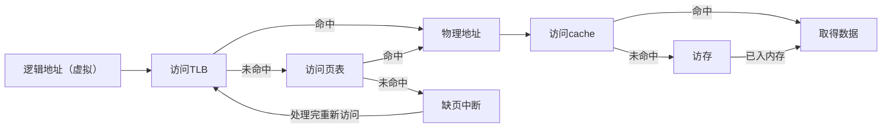

# 计算机组成原理期中考试

## 选择题

### 1. 【单选】（2 分）以下关于冯诺依曼结构计算机的叙述中，错误的是（ ）

- [ ] ​A. 由运算器、控制器、存储器和输入、输出设备组成
- [ ] B. 程序代码由指令组成，计算机按指定顺序自动执行指令
- [ ] C. 程序中所包含的指令和数据都以二进制形式表示
- [x] D. 程序被启动运行后，将被控制从外设直接读入 CPU 执行

> 参考答案：D
> 
> 本题考查冯诺依曼机特点
> 
> A、B、C 都是冯诺依曼机的特点，而 D 错误明显，外存中的数据和代码不能直接读入 CPU (两者速度差异太大，影响效率)，需要按照 $外存 \rightarrow 内存 \rightarrow CPU$ 的顺序，并且为了提高速度，内外存间有缓冲，内存与 CPU 间有 cache。

### 2. 【单选】（2 分）`float x = -253`，则 `x` 的机器数为（ ）

- [x] A. $C37D0000H$
- [ ] B. $C2FD0000H$ 
- [ ] C. $42FD0000H$
- [ ] D. $437D0000H$

> 参考答案：A
> 
> 本题考察 IEEE 754 浮点数
> 
> A 和 B 中第一位 16 进制为 $C$，即 $1100$，所以符号位为 $1$，真值为负，备选。
> A 的 2 进制为 $1100 0011 0111 1101 0000 0000 0000 0000$，移码为 $1000 0110$ 即阶码为 $7$，尾数（隐一位）为 $1.1111101$，所以真值为 $-1111101 \times 2^7 = -253$，故选 A。  
> B 的 2 进制为 $1100 0010 1111 1101 0000 0000 0000 0000$，移码为 $1000 0101$ 即阶码为 $6$，尾数（隐一位）为 $1111101$，所以真值为 $-1.111101 \times 2^6 = -126.5$，故排除。  
> C 和 D 中第一位 16 进制为 $4$，即 $0100$，所以符号位为 $0$，真值为正，排除。

### 3. 【单选】（2 分）数组 `int a[4] = {5, -5, 10, -10}`, `a` 地址为 $0x80521500$，则地址 $0x8052150C$ 中的内容为（ ）

- [ ] A. FF
- [x] B. F6
- [ ] C. 0A
- [ ] D. 05

> 参考答案：B
> 
> 本题考察数组、补码、小端方式
> 
> `int` 变量占 4 字节，`A[0]` 首地址是 $0x80521500$，`A[1]` 首地址是 $0x80521504$，`A[2]` 首地址是 $0x80521508$，`A[3]` 首地址是 $0x8052150C$，所以是 $-10$ 的首位，$-10$ 的十六进制为 $FF FF FF F6H$，又因为计算机中是小端存储，所以这四个字节排列顺序应该是 $F6$、$FF$、$FF$、$FF$。所以 $0x8052150C$ 应该是 $F6$。

### 4. 【单选】（2 分）C 语言代码代码如下，变量 `c` 的机器数为（ ）

```cpp
short a = -4100;
unsigned short b = a;
unsigned int c = b;
```
‍
- [ ] A. $0000DFFCH$
- [x] B. $0000EFFCH$
- [ ] C. $FFFFDFFCH$
- [ ] D. $FFFFEFFCH$

> 参考答案：B
> 
> 本题考察有符号数无符号数转化，以及无符号扩展
> 
> $4100 = 4096 + 4 - 2^{12} + 2^2 = 1004H，a = -4100 = (1004H)_{求补} = EFFCH$。  
> `b` 是无符号数且与 `a` 位数一样，所以 `b` 和 `a` 的机器数是一样的（值是溢出的）也是 $EFFCH$。  
> 而 `c` 和 `b` 都是无符号数，所以 `c = b` 是无符号扩展，直接在高位补 $0$（`c` 和 `b` 的值应该是一样的，所以高位为 $0$），即 `c = 0000EFFCH`。

### 5. 【单选】（2 分）有关程序计数器PC的叙述中，错误的是（ ）

- [ ] A. 每条指令执行后，PC 的值都会被改变
- [x] B. 任何指令顺序执行后，相比取指前 PC 的值总是自动加 1
- [ ] C. 调用指令执行后，PC 的值一定是被调用过程的入口地址
- [ ] D. 无条件转移指令执行后，PC 的值一定是转移目标地址

> 参考答案：B
> 
> A、C、D 都是正确的；而对于 B，有些指令需要取指 $n$ 次（比如某指令长度为 $64 bit$，存储字长为 $32 bit$，取这条指令需要访存两次，PC 需要 $+ 2$）PC 需要自动加 $n$。

### 6. 【单选】（2 分）有关存储器的叙述中，错误的是（    ）

- [ ] A. DRAM 集成度比 SRAM 高
- [ ] B. DRAM 内存条中的内部行缓存采用 SRAM 技术
- [x] C. 主存空间都是由随机访问存储器（RAM）构成
- [ ] D. SRAM 不需要刷新

> 参考答案：C
> 
> 本题考察 RAM
> 
> A、D 正确见 p97；B 干扰较大，在 DRAM 中为了提高写入速度，使用 SRAM 作为行缓存，故 B 正确；$主存 = ROM（少量）+ RAM（主要）$，故 C 错。

### 7. 【单选】（2 分）以下哪一种程序能很好发挥 cache 作用？

- [ ] A. 程序中各指令间相关度不高 
- [x] B. 程序有大量循环语句及数组元素顺序访问
- [ ] C. 程序整个大小不超过实际内存容量
- [ ] D. 程序中主要是各类算术或逻辑运算操作

> 参考答案：B
> 
> 本题考察 cache 和局部性原理，局部性越强，cache 越能发挥作用指令相关性指的是必须等前一条指令执行完成后，才能执行后一条指令，影响不大，排除 A；大量使用循环语句以及数组元素顺序访问有着空间局部性，有助于 cache 发挥作用，选 B；有请求调页功能，程序大小不影响 cache，排除 C；D 不影响，排除。

### 8. 【单选】（2 分）主存按字节编址，cache 有 512 行，采用 4 路组相联映射方式，主存块大小为 64 字节，编号从 0 开始。则主存单元 $0x80538900$ 对应的 cache 组号是（ ）

- [ ] A. 0
- [ ] B. 4
- [x] C. 36
- [ ] D. 100

> 参考答案：C
> 
> 本题考察 cache 映射
> 
> 对于 cache 映射首先需要把物理地址进行划分，按字节编址（如果没说的话也默认按字节），块大小为 $64 B = 2^6 B$，块内地址为 6 位，$512 / 4 = 128 = 2^7$，cache 块号为 7 位，其他高位为标记，经过分析发现只需要考虑后 13 位即可，主存单元 $0x80538900$ 后 16 位为 $8900H$ 即 $10010000000$，所以块号为 $0100100$，即 $36$，选 C。  
> 本题不要把 4 路组相联的 4 路当作块号部分。

### 9. 【单选】（2 分）下列关于 RISC 和 CISC 的说法正确的是（ ）

- [x] A. RISC 的内部通用寄存器数比 CISC 多
- [ ] B. RISC 的指令种类比 CISC 多
- [ ] C. CISC 必须实现指令流水线
- [ ] D. CISC 绝大多数指令在一个周期内完成

> 参考答案：A
> 
> 本题考察 CISC 和 RISC 比较，见 p185 表
> 
> CISC 表示复杂指令系统计算机（complex instruction），也就是说他的指令类型比较复杂  
> A 正确，选 A；CISC 指令种类比 RISC （只有 `Load/Store` 指令）多，B 错误；RISC 必须实现指令流水线，CISC 不需要，C错；CISC 指令类型复杂，所以不能保证在大多在一个周期完成，RISC 可以，D 错。

### 10. 【单选】（2 分）一个 $4K \times 32$ 位的 DRAM 的地址引脚和数据引脚之和为（ ）

- [ ] A. 44
- [ ] B. 42
- [x] C. 40
- [ ] D. 38

> 参考答案：D
> 
> RAM 引脚计算
> 
> $$
> \begin{aligned}
> DRAM（地址复用）&= 数据线 +（一半）地址线 + 行选 + 列选 + 读 + 写\\
SRAM &= 数据线 + 地址线 + 片选线 + 读 + 写
> \end{aligned}
> $$
> 行、列、读、写、片选都是一根  
> $4 K = 2^{12}，DRAM 数据引脚 + 地址引脚（一半）= 32 + 12 / 2 = 38$，选 D。

### 11. 【单选】（2 分）某计算机按字节编址，ROM 区为 $0000H ~ 0FFFH$，地址线为 16 位，再用 $2K \times 8$ 位的 RAM 构成剩下的空间，则需要这样的 RAM 芯片数为（ ）

- [ ] A. 15
- [ ] B. 16
- [x] C. 30
- [ ] D. 31

> 参考答案：D
> 
> 地址线为 16 位，总空间是 $000HFFFFH$，ROM 区为 $0000H ~ 0FFFH$ 则 RAM 区为 $1000H ~ FFFFH$。还剩 $15 \times 4 KB$，$(15 \times 4 KB) / 2 KB = 30$片，所以是 30 片 $2K \times 8$ 位的 RAM 芯片，选 D。

## 应用题

### 1. （13 分）某计算机有 cache 和 TLB ，按字节编址，虚拟地址位 16 位，物理地址为 12 位，页大小为 128 B ，TLB 采用 2 路组相联映射，共有 8 个页表项；cache 采用直接映射，块大小为 4 B ，共 16 行。某一时刻 cache、TLB 和页表中部分内容如下：

#### （1）虚拟地址中页号占多少位（1 分）

页大小为 $128 B$，按字节编址，所以页内地址为 $\log_{2}128 = 7$ 位，页号为 9 位

#### （2）写出虚拟地址的两种地址划分，以及每个字段位数及位置（两种：按页和按 TLB）（4 分）

页号 9 位（$a_{15} \sim a_7$），页内地址 7 位（$a_6 \sim a_0$）

页号 | 页内地址
:---: | :---:
9 位 | 7 位

TLB 标记 7 位（$a_{15} \sim a_9$），TLB 组索引 2 位（$a_8 \sim a_7$），页内地址 7 位（$a_6 \sim a_0$）

TLB 标记 | TLB 索引 | 页内地址
:---: | :---: | :---:
7 位 | 2 位 | 7 位

#### （3）写出物理地址的两种地址划分，以及每个字段位数及位置（两种：按页和按 cache）（4 分）

页框号 5 位（$a_{11} \sim a_7$），页内地址 7 位（$a_6 \sim a_0$）

页框号 | 页内地址
:---: | :---:
5 位 | 7 位

cache 标记 6 位（$a_{11} \sim a_6$），cache 行号 4 位（$a_5\ sim a_2$），块内地址 2 位（$a_1 \sim a_0$）

cache 标记 | cache 行号 | 块内地址
:---: | :---: | :---:
6 位 | 4 位 | 2 位

#### （4）从逻辑地址开始，描述 CPU 读取地址中内容的过程（可以画图，讨论不同情况）（4 分）



### 2. （10 分）请模拟 8 位寄存器进行补码减法 $A - B$ 的过程，包括溢出的判断（涉及什么标志）

#### （1）有符号数：`A = 125`，`B = -5`（5 分）

$125 = 1111101B$，所以 `A` 对应补码为 $0.1111101$

> 可以通过这种方法巧算：$128 - 3 = 10000000B - 11B = 1111101B$

$5 = 101B$，所以 `B` 对应补码等于 $101$ 求补，`B` 为 $1.1111011 - B$ 是 `B` 求补也就是 $0.0000101$

$0.111101 + 0.0000101 = (0)1.000010$，其中加法器进位 $C = 0$，符号位 $SF = 1$

有符号数溢出判断 $OF = C \oplus SF = 0 \oplus 1 = 1$，所以溢出。

#### （2）无符号数：`A = 7`，`B = 9`（5 分）

$7 = 111B，9 = 1001B$

所以无符号数 `A = 00000111`，`B= 00001001`

因为是减法，所以减法标志 `Sub = 1`，B 求补变成 $11110111$

$00000111 + 11110111 = (0)11111110$，其中加法器进位 $C = 0$

无符号数溢出（无符号不叫溢出，叫做是否进位借位）$CF = C \oplus Sub = 0 \oplus 1 = 1$，有借位，其真值溢出。