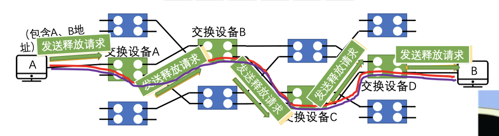
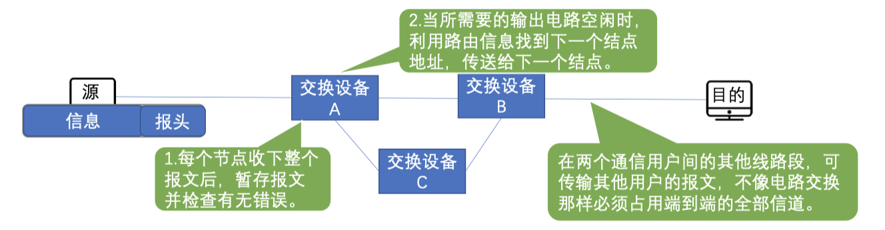
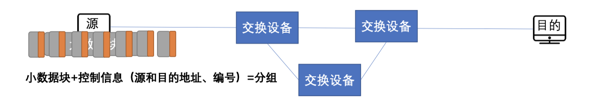
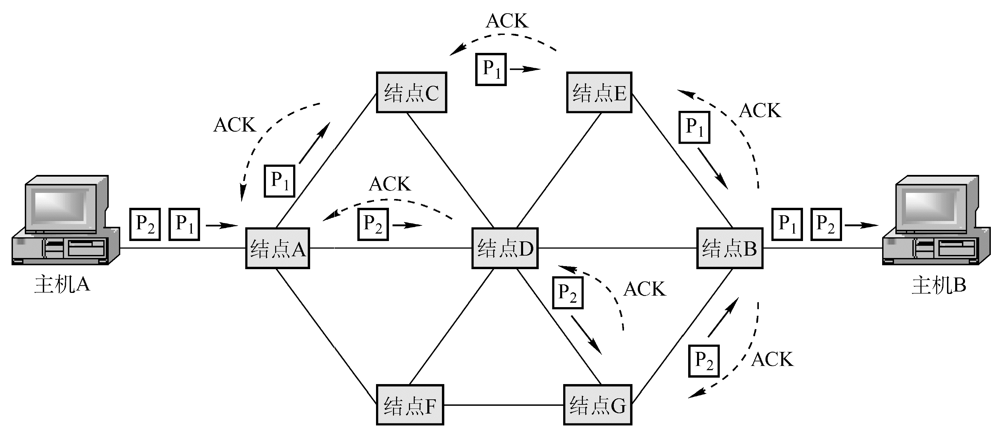
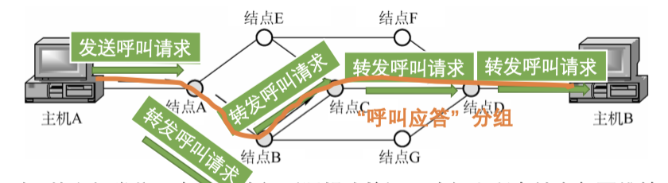
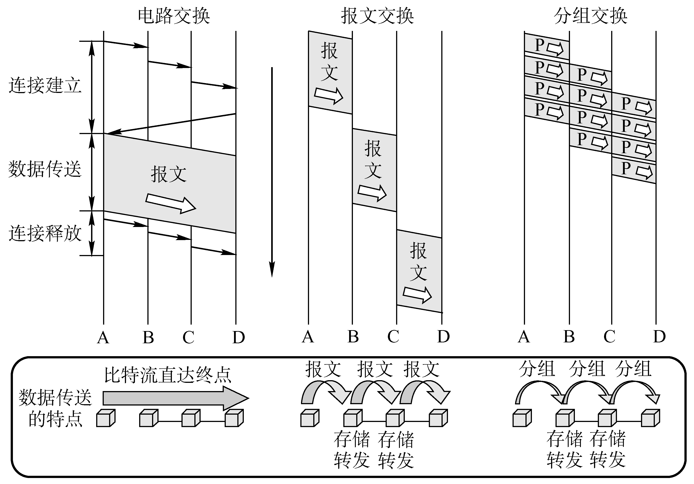

# 数据交换方式

$$
\begin{array}{cccc}
  电路交换\\ \\
  存储转发交换方式
  \begin{cases}
    报文交换\\
    分组交换
    \begin{cases}
      数据报方式\\
      虚电路方式
    \end{cases}
  \end{cases}
\end{array}
$$

### 电路交换（Circuit Exchanging）

**电路交换的原理**：在数据传输期间，源结点与目的结 点之间有一条由中间结点构成的专用物理连接线路，在数据传输结束之前，这条线路一直保持。

**电路交换的阶段**：

$$
建立连接（呼叫/电路建立）\to 通信（数据传输） \to 释放连接（拆除电路）
$$

**特点**：独占资源，用户始终占用端到端的固定传输带宽。适用于远!程批处理信息传输或系统间实时性要求高的大量数据传输的情况。

电路交换优点 | 电路交换缺点
--- | ---
传输时延小 | 建立连接时间长
数据顺序传送，无失序问题 | 线路独占，即使通信线路空闲，也不能供其他用户使用，信道使用效率低。
实时性强，双方一旦建立物理通路，便可以实时通信， 适用于交互式会话类通信 | 灵活性差，双方连接通路中的任何一点出了故障，必须重新拨号建立新连接，不适应突发性通信
全双工通信，没有冲突，通信双方有不同的信道，不会争用物理信道 | 无数据存储能力，难以平滑通信量
适用于模拟信号和数字信号 | 电路交换时，数据直达，不同类型、不同规格、不同速率的终端很难相互进行通信
控制简单，电路的交换设备及控制较简单 | 无法发现与纠正传输差错，难以在通信过程中进行差错控制。

### 报文交换（Message Exchanging）

**报文（message）**：报文是网络中交换与传输的数据单元，即站点一次性要发送的数据块。报文包含了将要发送的 完整的数据信息，其长短很不一致，长度不限且可变。

**报文交换的原理**：无需在两个站点之间建立一条专用通路，其数据传输的单位是报文，传送过程采用存储转发方式。

<table>
  <tr>
    <th>报文交换优点</th>
    <th>报文交换缺点</th>
  </tr>
  <tr>
    <td>无需建立连接，无建立连接时延，用户可随时发送报文</td>
    <td>实时性差，不适合传送实时或交互式业务的数据。数据进入交换结点后要经历存储转发过程，从而引起转发时延</td>
  </tr>
  <tr>
    <td>动态分配线路，动态选择报文通过的最佳路径，可以平滑通信量</td>
    <td>只适用于数字信号。</td>
  </tr>
  <tr>
    <td>提高线路可靠性，某条传输路径发生故障，可重新选择另一条路径传输。</td>
    <td rowspan="4">由于报文长度没有限制，而每个中间结点都要完整地接收传来的整个报文，当输出线路不空闲时，还可能要存储几个完整报文等待转发，要求网络中每个结点有较大的缓冲区。为了降低成本，减少结点的缓冲存储器的容量，有时要把等待转发的报文存在磁盘上，进一步增加了传送时延。</td>
  </tr>
  <tr>
    <td>提高线路利用率，通信双方在不同的时间一段一段地 部分占有这条物理通道，多个报文可共享信道。</td>
  </tr>
  <tr>
    <td>提供多目标服务：一个报文可同时发往多个目的地址。</td>
  </tr>
  <tr>
    <td>在存储转发中容易实现代码转换和速率匹配，甚至收发双方可以不同时处于可用状态。这样就便于类型、 规格和速度不同的计算机之间进行通信。</td>
  </tr>
</table>

### 分组交换（Packet Exchanging）

**分组（packet）**：大多数计算机网络都不能连续地传送任意长的数据，所以实际上网络系统把数据分割成小块，然后逐 块地发送，这种小块就称作分组。

**分组交换的原理**：分组交换与报文交换的工作方式基本相同，都采用存储转发方式，形式上的主要差别在于，分组交换网中要限制所传输的数据单位的长度，一般选 128B。发送节点首先对从终端设备送来的数据报文进行接收、存储，而后将报文划分成一定长度的分组，并以分组为单位进行传输和交换。接收结点将收到的分组组装成信息或报文。

<table>
  <tr>
    <th>分组交换优点</th>
    <th>分组交换缺点</th>
  </tr>
  <tr>
    <td>无建立时延，无需为通信双方预先建立一条专用通信线路，用户可随时发送分组。</td>
    <td>尽管分组交换比报文交换的传输时延少，但仍存在存储转发时延，而且其结点交换机必须具有更强的处理能力。</td>
  </tr>
  <tr>
    <td>线路利用率高，通信双方在不同的时间一段一段地部分占有这条物理通道，多个分组可共享信道。</td>
    <td>每个分组都要加控制信息，一定程度上降低了通信效率，增加了处理的时间。</td>
  </tr>
  <tr>
    <td>简化了存储管理。因为分组的长度固定，相应的缓冲区的大小也固定，在交换结点中存储器的管理通常被简化为对缓冲区的管理，相对比较容易。</td>
    <td rowspan="4">当分组交换采用数据报服务时，可能出现失序、丢失或重复分组，分组到达目的结点时，要对分组按编号进行排序等工作，增加了麻烦。若采用虚电路服务，虽无失序问题，但有呼叫建立、数据传输和虚电路释放三个过程。</td>
  </tr>
  <tr>
    <td>加速传输，后一个分组的存储可以和前一个分组的转发并行操作；传输一个分组比一份报文所需缓冲区小，减少等待发送时间。</td>
  </tr>
  <tr>
    <td>减少出错几率和重发数据量，提高可靠性，减少传输时延。</td>
  </tr>
  <tr>
    <td>分组短小，适用于计算机之间突发式数据通信。</td>
  </tr>
</table>

#### 数据报方式

1. 源主机（A）**将报文分成多个分组**，依次发送到直接相连的结点（A）。

2. 结点 A 收到分组后，对每个分组 **差错检测** 和 **路由选择**，不同分组的下一跳结点可能不同。

3. 结点 C 收到分组 P1 后，对分组 P1 进行 **差错检测**，若正确则向 A 发送确认信息，A 收到 C 确认后则丢弃分组 P1 副本。

4. 所有分组到家（主机 B）！

**数据报方式的特点**

1. 数据报方式为网络层提供无连接服务。发送方可随时发送分组，网络中的结点可随时接收分组。
2. 同一报文的不同分组达到目的结点时可能发生乱序、重复与丢失。
3. 每个分组在传输过程中都必须携带源地址和目的地址，以及分组号。
4. 分组在交换结点存储转发时，需要排队等候处理，这会带来一定的时延。当通过交换结点的通信量较大或网络发生拥塞时，这种时延会大大增加，交换结点还可根据情况丢弃部分分组。
5. 网络具有冗余路径，当某一交换结点或一段链路出现故障时，可相应地更新转发表，寻找另一条路径转发分组，对故障的适应能力强，适用于突发性通信，不适于长报文、会话式通信。

> **无连接服务**：不事先为分组的传输确定传输路径，每个分组独立确定传输路径，不同分组传输路径可能不同。

#### 虚电路方式

虚电路将数据报方式和电路交换方式结合，以发挥两者优点。

**虚电路**：一条源主机到目的主机类似于电路的路径（逻辑连接），路径上所有结点都要维持这条虚电路的建立，都维持一张虚电路表，每一项记录了一个打开的虚电路的信息。

- **建立连接（虚电路建立）**：源主机发送「呼叫请求」分组并收到「呼叫应答」分组后才算建立连接。
- **数据传输**：每个分组携带虚电路号，分组号、检验和等控制信息。
- **释放连接（虚电路释放）**：源主机发送「释放请求」分组以拆除虚电路。

**虚电路方式的特点**

1. 虚电路方式为网络层提供连接服务。源节点与目的结点之间建立一条逻辑连接，而非实际物理连接。
2. 一次通信的所有分组都通过虚电路顺序传送，分组不需携带源地址、目的 地址等信息，包含虚电路号，相对数据报方式开销小，同一报文的不同分组到达目的结点时不会乱序、重复或丢失。
3. 分组通过虚电路上的每个节点时，节点只进行差错检测，不需进行路由选择。
4. 每个节点可能与多个节点之间建立多条虚电路，每条虚电路支持特定的两个端系统之间的数据传输，可以对两个数据端点的流量进行控制，两个端系统之间也可以有多条虚电路为不同的进程服务。
5. 致命弱点：当网络中的某个结点或某条链路出故障而彻底失效时，则所有经过该结点或该链路的虚电路将遭到破坏

> **连接服务**：首先为分组的传输确定传输路径（建立连接），然后沿该路径（连接）传输系列分组，系列分组传输路径相同，传输结束后拆除连接。

--- | 数据报服务 | 虚电路服务
:---: | --- | ---
连接的建立 | 不要 | 必须有
目的地址 | 每个分组都有完整的目的地址 | 仅在建立连接阶段使用，之后每个分组使用长度较短的虚电路号
路由选择 | 每个分组独立地进行路由选择和转发 | 属于同一条虚电路的分组按照同一路由转发
分组顺序 | 不保证分组的有序到达 | 保证分组的有序到达
可靠性 | 不保证可靠通信，可靠性由用户主机来保证 | 可靠性由网络保证
对网络故障的适应性 | 出故障的结点丢失分组，其他分组路径选择发生变化，可正常传输 | 所有经过故障结点的虚电路均不能正常工作
差错处理和流量控制 | 由用户主机进行流量控制，不保证数据报的可靠性 | 可由分组交换网负责，也可由用户主机负责

## 数据交换方式的选择

1. 传送数据量大，且传送时间远大于呼叫时，选择 **电路交换**。电路交换传输时延最小。

2. 当端到端的通路有很多段的链路组成时，采用 **分组交换** 传送数据较为合适。

3. 从信道利用率上看，**报文交换** 和 **分组交换** 优于电路交换，其中 **分组交换** 比报文交换的时延小，尤其适合于计算机之间的突发式的数据通信。
