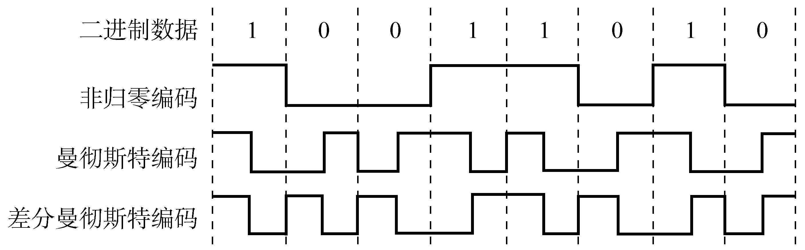
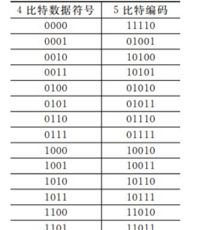
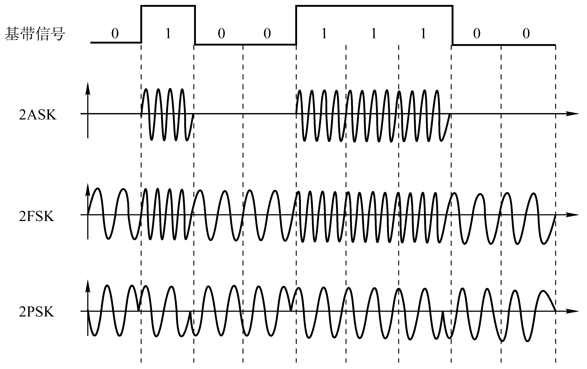
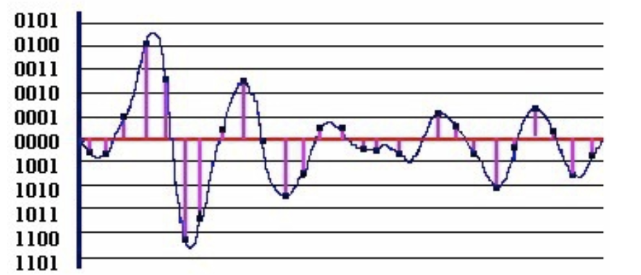

# 编码与调制

## 基带信号与宽带信号

**信道**：信号的传输媒介。一般用来表示向某一个方向传送信息的介质，因此一条通信线路往往包含一 条发送信道和一条接收信道。

$$
信道
\begin{array}{llll}
  \xrightarrow{传输信号}
  \begin{cases}
    模拟信道（传送模拟信号）\\
    数字信道（传送数字信号）
  \end{cases}\\ \\
  \xrightarrow{传输介质}
  \begin{cases}
  无线信道\\
  有线信道
  \end{cases}
\end{array}
$$

### 信道上传送的信号

**基带信号**：将数字信号 1 和 0 直接用两种不同的电压表示，再送到 ==数字信道== 上去传输（==**基带传输**==）。==来自信源== 的信号，像计算机输出的代表各种文字或图像文件的数据信号都属于基带信号。基带信号就是发出的 **直接表达了要传输的信息的信号**，比如我们说话的声波就是基带信号。

**宽带信号**：将基带信号进行调制后形成的频分复用模拟信号，再传送到 ==模拟信道== 上去传输（==**宽带传输**==）。  
把基带信号经过载波调制后，把信号的频率范围搬移到较高的频段以便在信道中传输（即仅 在一段频率范围内能够通过信道）。

> 在传输距离较近时，计算机网络采用 **基带传输** 方式（近距离衰减小，从而信号内容不易发生变化）
> 在传输距离较远时，计算机网络采用 **宽带传输** 方式（远距离衰减大，即使信号变化大也能最后过滤出来基带信号）

## 编码与调制

$$
\begin{array}{cccc}
  \begin{array}{cccc}
    数据 \to 数字信号 & 编码 \\
    数据 \to 模拟信号 & 调制
  \end{array} \\ \\
  \begin{array}{cccc}
    数字数据
    \begin{array}{cccc}
      \xrightarrow{数字发送器} & 数字信号 & 编码\\
      \xrightarrow{调制器} & 模拟信号 & 调制
    \end{array} &
    模拟数据
    \begin{array}{cccc}
      \xrightarrow{PCM编码器} & 数字信号 & 编码 \\
      \xrightarrow{放大器调制器} & 模拟信号 & 调制
    \end{array}
  \end{array}
\end{array}
$$

### 数字数据编码为数字信号

**非归零编码（NRZ）**：编码容易实现，但没有检错功能，且无法判断一个码元的开始和结束，以至于收发双方难以保持同步。

> 高 1 低 0

**归零编码（RZ）**：信号电平在一个码元之内都要恢复到零的这种编码成编码方式。

**曼彻斯特编码**：将一个码元分成两个相等的间隔，前一个间隔为低电平后一个间隔为高电平表示码元 1；码元 0 则正好相反。也可以采用相反的规定。该编码的特点是在每一个码元的中间出现电平跳变，位中间的跳变既作时钟信号（可用于同步），又作数据信号，但它所占的频带宽度是原始的基带宽度的两倍。每一个码元都被调成两个电平，所以数据传输速率只有调制速率的 $\frac{1}{2}$。

**差分曼彻斯特编码**：常用于局域网传输，其规则是：若码元为 1，则前半个码元的电平与上一个码元的后半个码元的电平相同，若为 0，则相反。该编码的特点是，在每个码元的中间，都有一次电平的跳转，可以实现自同步，且抗干扰性强于曼彻斯特编码。

> 同 1 异 0

**4B/5B 编码**：比特流中插入额外的比特以打破一连串的 0 或 1，就是用 5 个比特来编码 4 个比特的数据，之后再传给接收方，因此称为 4B/5B。编码效率为 80%。

只采用 16 种对应 16 种不同的 4 位码，其他的 16 种作为控制码（帧的开始和结束，线路的状态信息等）或保留。

### 数字数据调制为模拟信号

数字数据调制技术在发送端将数字信号转换为模拟信号，而在接收端将模拟信号还原为数字信号，分别对应于调制解调器的调制和解调过程。

**调幅 + 调相（QAM）**

> 某通信链路的波特率是 1200 Baud，采用 4 个相位，每个相位有 4 种振幅的 QAM 调制技术，则该链路的信息传输速率是多少？
>
> $1200 \times \log_{2}(4 \times 4) = 4800 bit/s$

### 模拟数据编码为数字信号

计算机内部处理的是二进制数据，处理的都是数字音频，所以需要将模拟音频通过采样、量化转换成有限个数字表示的离散序列（即实现音频数字化）。 最典型的例子就是对音频信号进行编码的脉码调制（PCM），在计算机应用中，能够达到最高保真水平的就是 PCM 编码，被广泛用于素材保存及音乐欣赏，CD、DVD 以及我们常见的 WAV 文件中均有应用。它主要包括三步：抽样、量化、编码。

1. **抽样**：对模拟信号周期性扫描，把时间上连续的信号变成时间上离散的信号。为了使所得的离散信号能无失真地代表被抽样的模拟数据，要使用采样定理进行采样：$f_{采样频率} \ge 2f_{信号最高频率}$。
2. **量化**：把抽样取得的电平幅值按照一定的分级标度转化为对应的数字值，并取整数，这就把连续的电平幅值转换为离散的数字量。
3. **编码**：把量化的结果转换为与之对应的二进制编码。

### 模拟数据调制为模拟信号

为了实现传输的有效性，可能需要较高的频率。这种调制方式还可以使用频分复用技术，充分利用带宽资源。在电话机和本地交换机所传输的信号是采用模拟信号传输模拟数据的方式；模拟的声音数据是加 载到模拟的载波信号中传输的。
