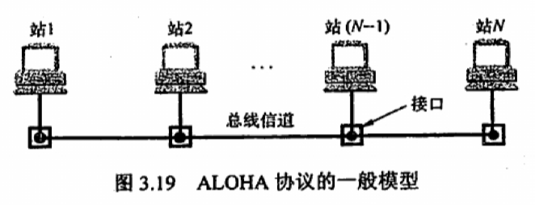
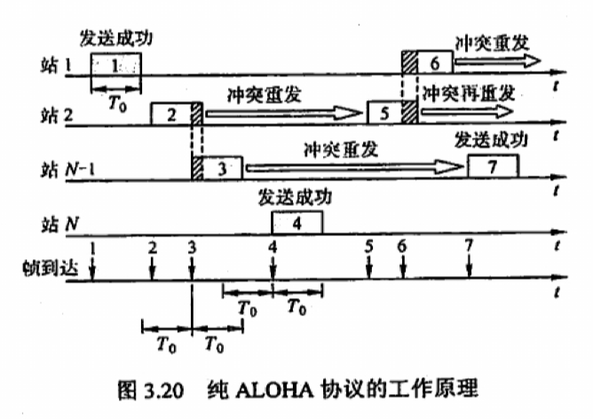
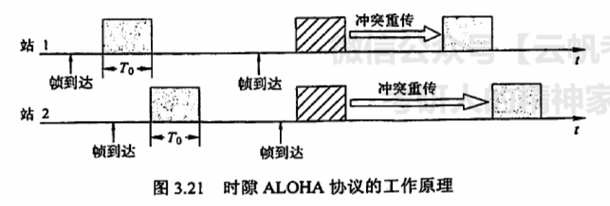
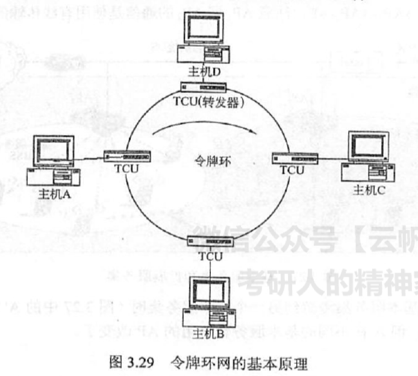

### 随机访问介质访问控制

在随机访问协议中，不采用集中控制方式解决发送信息的次序问题，所有用户能根据自己的意愿随机地发送信息，占用信道全部速率。在总线形网络中，当有两个或多个用户同时发送信息时，就会产生帧的冲突（碰撞，即前面所说的相互干扰），导致所有冲突用户的发送均以失败告终。为了解决随机接入发生的碰撞，每个用户需要按照一定的规则反复地重传它的帧，直到该帧无碰撞地通过。这些规则就是随机访问介质访问控制协议，常用的协议有 ALOHA 协议、CSMA 协议、CSMA/CD 协议和 CSMA/CA 协议等，它们的核心思想都是：胜利者通过争用获得信道，从而获得信息的发送权。因此，随机访问介质访问控制协议又称争用型协议。读者会发现，如果介质访问控制采用信道划分机制，那么结点之间的通信要么共享空间，要么共享时间，要么两者都共享；而如果采用随机访问控制机制，那么各结点之间的通信就可既不共享时间，也不共享空间。所以随机介质访问控制实质上是一种将广播信道转化为点到点信道的行为。

#### 1. ALOHA 协议

夏威夷大学早期研制的随机接入系统称为 ALOHA，它是 **A**dditive **L**ink **O**n-line **Ha**waii system 的缩写。ALOHA 协议分为纯 ALOHA 协议和时隙 ALOHA 协议两种。

##### （1）纯 ALOHA 协议

纯 ALOHA 协议的基本思想是，当网络中的任何一个站点需要发送数据时，可以不进行任何检测就发送数据。如果在一段时间内未收到确认，那么该站点就认为传输过程中发生了冲突。发送站点需要等待一段时间后再发送数据，直至发送成功。图 3.19 所示的模型不仅可代表总线形网络的情况，而且可以代表无线信道的情况。

图 3.20 表示一个纯 ALOHA 协议的工作原理。每个站均自由地发送数据帧。为简化问题，不考虑由信道不良而产生的误码，并假定所有站发送的帧都是定长的，帧的长度不用比特而用发送这个帧所需的时间来表示，在图 3.20 中用 $T_0$ 表示这段时间。

在图 3.20 的例子中，当站 1 发送帧 1 时，其他站都未发送数据，所以站 1 的发送必定是成功的。但随后站 2 和站 $N-1$ 发送的帧 2 和帧 3 在时间上重叠了一些（即发生了碰撞）。碰撞的结果是，碰撞双方（有时也可能是多方）所发送的数据出现了差错，因而都须进行重传。但是发生碰撞的各站并不能马上进行重传，因为这样做必然会继续发生碰撞。纯 ALOHA 系统采用的重传策略是让各站等待一段随机的时间，然后再进行重传。若再次发生碰撞，则需要再等待一段随机的时间，直到重传成功为止。图中其余一些帧的发送情况是帧 4 发送成功，而帧 5 和帧 6 发生碰撞。

假设网络负载（$T_0$ 时间内所有站点发送成功的和未成功而重传的帧数）为 $G$，则纯 ALOHA 网络的吞吐量（$T_0$ 时间内成功发送的平均帧数）为 $S = Ge^{-2G}$。当 $G = 0.5$ 时，$S = 0.5e^{-1} \approx 0.184$，这是吞吐量 $S$ 可能达到的极大值。可见，纯 ALOHA 网络的吞吐量很低。为了克服这一缺点，人们在原始的纯 ALOHA 协议的基础上进行改进，产生了时隙 ALOHA 协议。

##### （2）时隙 ALOHA 协议

时隙 ALOHA 协议把所有各站在时间上同步起来，并将时间划分为一段段等长的时隙（Slot），规定只能在每个时隙开始时才能发送一个帧。从而避免了用户发送数据的随意性，减少了数据产生冲突的可能性，提高了信道的利用率。
图 3.21 为两个站的时隙 ALOHA 协议的工作原理示意图。时隙的长度 $T_0$ 使得每个帧正好在一个时隙内发送完毕。每个帧在到达后，一般都要在缓存中等待一段小于 $T_0$ 的时间，然后才能发送出去。在一个时隙内有两个或两个以上的帧到达时，在下一一个时隙将产生碰撞。碰撞后重传的策略与纯 ALOHA 的情况是相似的。

时隙 ALOHA 网络的吞吐量 $S$ 与网络负载 $G$ 的关系是 $S = Ge^{-G}$。当 $G = 1$ 时，$S = e^{-1} \approx 0.368$。这是吞吐量 $S$ 可能达到的极大值。可见，时隙 ALOHA 网络比纯 ALOHA 网络的吞吐量大了 1 倍。

#### 2. CSMA 协议

时隙 ALOHA 系统的效率虽然是纯 ALOHA 系统的两倍，但每个站点都是随心所欲地发送数据的，即使其他站点正在发送也照发不误，因此发送碰撞的概率很大。

若每个站点在发送前都先侦听一下共用信道，发现信道空闲后再发送，则就会大大降低冲突
的可能，从而提高信道的利用率，载波侦听多路访问（Carrier Sense Multiple Access，CSMA）协议依据的正是这一思想。CSMA 协议是在 ALOHA 协议基础上提出的一种改进协议, 它与 ALOHA 协议的主要区别是多了一个载波侦听装置。

根据侦听方式和侦听到信道忙后的处理方式不同，CSMA 协议分为三种。

##### （1）$1$—坚持 CSMA

$1$—坚持 CSMA（$1$-persistent CSMA）的基本思想是：一个结点要发送数据时，首先侦听信道；如果信道空闲，那么立即发送数据；如果信道忙，那么等待，同时继续侦听直至信道空闲；如果发生冲突，那么随机等待一段时间后，再重新开始侦听信道。

「$1$—坚持」的含义是：侦听到信道忙后，继续坚持侦听信道；侦听到信道空闲后，发送帧的概率为 $1$，即立刻发送数据。

传播延迟对 $1$—坚持 CSMA 协议的性能影响较大。结点 A 开始发送数据时，结点 B 也正好有数据要发送，但这时结点 A 发出数据的信号还未到达结点 B ，结点 B 侦听到信道空闲，于是立即发送数据，结果必然导致冲突。即使不考虑延迟，$1$—坚持 CSMA 协议也可能产生冲突。例如，结点 A 正在发送数据时，结点 B 和 C 也准备发送数据，侦听到信道忙，于是坚持侦听，结果当结点 A 一发送完毕，结点 B 和 C 就会立即发送数据，同样导致冲突。

##### （2）非坚持 CSMA

非坚持 CSMA（Non-persistent CSMA）的基本思想是：一个结点要发送数据时，首先侦听信道；如果信道空闲，那么立即发送数据；如果信道忙，那么放弃侦听，等待一个随机的时间后再重复上述过程。

非坚持 CSMA 协议在侦听到信道忙后就放弃侦听，因此降低了多个结点等待信道空闲后同时发送数据导致冲突的概率，但也会增加数据在网络中的平均延迟。可见，信道利用率的提高是以增加数据在网络中的延迟时间为代价的。

##### （3）$p$—坚持 CSMA

$p$—坚持 CSMA（$p$-persistent CSMA）用于时分信道，其基本思想是：一个结点要发送数据时，首先帧听信道；如果信道忙，就持续侦听，直至信道空闲；如果信道空闲，那么以概率 $p$ 发送数据，以概率 $1-p$ 推迟到下一个时隙；如果在下一个时隙信道仍然空闲，那么仍以概率 $p$ 发送数据，以概率 $1-p$ 推迟到下一个时隙；这个过程一直持续到数据发送成功或因其他结点发送数据而检测到信道忙为止，若是后者，则等待下一个时隙再重新开始帧听。

$p$—坚持 CSMA 在检测到信道空闲后，以概率 $p$ 发送数据，以概率 $1-p$ 推迟到下一个时隙，其目的是降低 $1$—坚持 CSMA协议中多个结点检测到信道空闲后同时发送数据的冲突概率；采用坚持「帧听」的目的是，试图克服非坚持 CSMA 协议中由于随机等待而造成的延迟时间较长的缺点。因此，$p$—坚持 CSMA 协议是非坚持 CSMA 协议和 $1$—坚持 CSMA 协议的折中方案。

三种不同类型的 CSMA 协议比较如表所示。

信道状态 | $1$—坚持 | 非坚持 | $p$—坚持
:---: | --- | --- | ---
空闲 | 立即发送数据 | 立即发送数据 | 以概率 $p$ 发送数据，以概率 $1-p$ 推迟到下一个时隙
忙 | 继续坚持监听 | 放弃侦听，等待一个随机的时间后再侦听 | 持续侦听，直至信道空闲

### 轮询访问介质访问控制：令牌传递协议

在轮询访问中，用户不能随机地发送信息，而要通过一个集中控制的监控站，以循环方式转询每个结点，再决定信道的分配。当某结点使用信道时，其他结点都不能使用信道。典型的轮询访问介质访问控制协议是令牌传递协议，它主要用在令牌环局域网中。

在令牌传递协议中，一个令牌在各结点间以某个固定次序交换。令牌是由一组特 殊的比特组合而成的帧。当环上的一个站希望传送帧时，必须等待令牌。一旦收到令牌，站点便可启动发送帧。帧中包括目的站的地址，以标识哪个站应接收此帧。帧在环上传送时，不管该帧是否是发给本站点的，所有站点都进行转发，直到该帧回到它的始发站，并由该始发站撤销该帧。帧的目的站除转发帧外，应针对该帧维持一个副本， 并通过在帧的尾部设置「响应比特」来指示已收到此副本。站点在发送完一帧后， 应释放令牌，以便让其他站使用。

当计算机都不需要发送数据时，令牌就在环形网上游荡，而需要发送数据的计算机只有在拿到该令牌后才能发送数据帧，因此不会发送冲突（因为令牌只有一个）。

在令牌传递网络中，传输介质的物理拓扑不必是一个环，但是为了把对介质访问的许可从一个设备传递到另一个设备， 令牌在设备间的传递通路逻辑上必须是一个环。

轮询介质访问控制非常适合负载很高的广播信道。所谓负载很高的信道，是指多个结点在同一时刻发送数据概率很大的信道。可以想象，如果这样的广播信道采用随机介质访问控制，那么发生冲突的概率将会很大，而采用轮询介质访问控制则可以很好地满足各结点间的通信需求。

轮询介质访问控制既不共享时间，也不共享空间，它实际上是在随机介质访问控制的基础上，限定了有权力发送数据的结点只能有一个。

即使是广播信道也可通过介质访问控制机制使广播信道逻辑上变为点对点的信道，所以说数链路层研究的是「点到点」之间的通信。

### 令牌环网的基本原理

令牌环网的基本原理如图 3.29 所示。令牌环网的每一站通过电缆与环接口干线耦合器（TCU）相连。TCU 的主要作用是，传递所有经过的帧，为接入站发送和接收数据提供接口。与此对应，TCU 的状态也有两个：收听状态和发送状态。数据总是在某个特定的方向上从一个 TCU 到下一个 TCU 逐比特地依次传送，每个 TCU 重新产生并重新传输每一比特。

令牌环网的媒体接入控制机制采用的是分布式控制模式的循环方法。在令牌环网中有一个令牌（Token）沿着环形总线在入网结点计算机间依次传递，令牌实际上是一个特殊格式的 MAC 控制帧，它本身并不包含信息，仅控制信道的使用，确保在同一时刻只有一个结点能够独占信道。站点只有取得令牌后才能发送数据帧，因此令牌环网不会发生碰撞。由于令牌在网环上是按顺序依次传递的，因此对所有入网计算机而言，访问权是公平的。

令牌环网中令牌和数据的传递过程如下：

1. 网络空闲时，环路中只有令牌帧在循环传递。
2. 令牌传递到有数据要发送的站点处时，该站点就修改令牌中的一个标志位，并在令牌中附加自己需要传输的数据，将令牌变成一个数据帧，然后将这个数据帧发送出去。
3. 数据帧沿着环路传输，接收到的站点一边转发数据，一边查看帧的目的地址。如果目的地址和自己的地址相同，那么接收站就复制该数据帧以便进一步处理。
4. 数据帧沿着环路传输，直到到达该帧的源站点，源站点接收到自己发出去的数据帧后便不再进行转发。同时，发送方可以通过检验返回的数据帧来查看数据传输过程中是否有错，若有错则重传该帧。
5. 源站点传送完数据后，重新产生一个令牌，并将令牌传递给下一个站点，以交出对媒体的访问权限。

令牌环网在物理上采用星形拓扑结构，但逻辑上仍是环形拓扑结构，其标准由 IEEE 802.5 定义。图 3.29 中的环并不是由通信线路连接而成的物理环。
