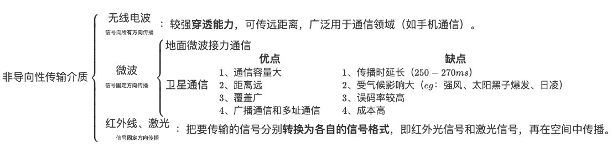

## 非导向性传输介质

## 物理层设备

### 中继器

**诞生原因**：由于存在损耗，在线路上传输的信号功率会逐渐衰减，衰减到一定程度时将造成信号失真，因此会导致接收错误。

**中继器的功能**： 对信号进行 **再生和还原**，对衰减的信号进行放大，保持与原数据相同，以增加信号传输的距离，延长网络的长度。

**中继器的两端**：两端的网络部分是网段，而不是子网，适用于完全相同的 **两类** 网络的互连，且两个网段速率要相同。  
中继器只将任何电缆段上的数据发送到另一段电缆上，它仅作用于信号的电气部分，并不管数据中是否有错误数据或不适于网段的数据。  
两端可连相同媒体，也可连不同媒体。  
中继器两端的网段一定要是同一个协议。（中继器不会存储转发，傻）

**5-4-3 规则**：网络标准中都对信号的延迟范围作了具体的规定，因而中继器只能在规定的范围内进行，否则会网络故障。

### 集线器（多口中继器）

**集线器的功能**：对信号进行再生 **放大转发**，对衰减的信号进行放大，接着转发到其他所有（除输入端口外）处于工作状态的端口上，以增加信号传输的距离，延长网络的长度。不具备信号的定向传送能力，是一个共享式设备。
