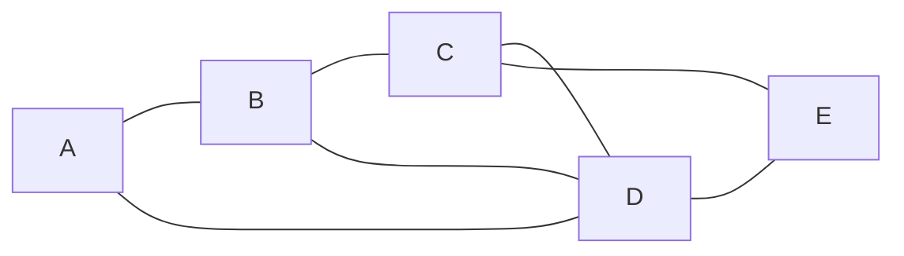

# 计算机网络期末考试

## 选择题

## 应用题

### 1. (10 分) 设某网络的结构如下图所示，已知节点 C 到相邻节点 B、D、E 的代价分别为 2，5，3。节点 C 收到从相邻节点 B、D、E 的向量表如下面 3 个表所示。试用距离矢量路由算法为节点 C 计算到各节点的路由表（目的地、下一站、代价）。

源节点 | 目的地 | 代价 || 源节点 | 目的地 | 代价 | | 源节点 | 目的地 | 代价
:---: | :---: | :---: | --- | :---: | :---: | :---: | --- | :---: | :---: | :---:
B | A | 3 || D | A | 2 || E | A | 5  
|| B | 0 || | B | 3 || | B | 4
|| C | 2 || | C | 2 || | C | 2
|| D | 1 || | D | 0 || | D | 2
|| E | 5 || | E | 1 || | E | 0

源节点 | 目的地 | 下一站 | 代价
:---: | :---: | :---: | :---:
 C | A | B | 5
|| B | B | 2
|| C | C | 0
|| D | B | 3
|| E | E | 3

### 2. （17 分）TCP 的拥塞窗口 `cwnd` 大小与传输轮次 $n$ 的关系如下所示：

`cwnd` | 1 | 2 | 4 | 8 | 16 | 32 | 33 | 34 | 35 | 36 | 37 | 38 | 39 | 40 | 41 | 42 | 21 | 22 | 23 | 24 | 25 | 26 | 1 | 2 | 4 | 8
:---: | :---: | :---: | :---: | :---: | :---: | :---: | :---: | :---: | :---: | :---: | :---: | :---: | :---: | :---: | :---: | :---: | :---: | :---: | :---: | :---: | :---: | :---: | :---: | :---: | :---: | :---:
$n$ | 1 | 2 | 3 | 4 | 5 | 6 | 7 | 8 | 9 | 10 | 11 | 12 | 13 | 14 | 15 | 16 | 17 | 18 | 19 | 20 | 21 | 22 | 23 | 24 | 25 | 26

#### （1）指明 TCP 工作在慢开始阶段的时间间隔。

$[1, 6]$ 和 $[23, 26]$。

#### （2）指明 TCP 工作在拥塞避免阶段的时间间隔。

$[6, 16]$ 和 $ [17, 22]$。

#### （3）在第 16 轮次和第 22 轮次之后发送方是通过收到三个重复的确认还是通过超时检测到丢失了报文段？

- 在第 16 轮次之后发送方通过收到三个重复的确认检测到丢失的报文段；
- 在第 22 轮次之后发送方是通过超时检测到丢失的报文段。

#### （4）在第 1 轮次、第 18 轮次和第 24 轮次发送时，门限 `ssthresh` 分别被设置为多大？

- 在第 1 轮次发送时，门限 `ssthresh` 被设置为 32；
- 在第 18 轮次发送时，门限 `ssthresh` 被设置为发生拥塞时的一半，即 21；
- 在第 24 轮次发送时，门限`ssthresh` 是第 18 轮次发送时设置的 21。

#### （5）在第几轮次发送出第 70 个报文段？

在第 7 轮次发送出第 70 个报文段。

#### （6）假定在第 26 轮次之后收到了三个重复的确认，因而检测出了报文段的丢失，那么拥塞窗口 `cwnd` 和门限 `ssthresh` 应设置为多大？

拥塞窗口 `cwnd` 和门限 `ssthresh` 应设置为 8 的一半，即 4。

### 3. （18 分）某网络拓扑如图所示，路由器 $R_1$ 通过接口 $E_1$、$E_2$ 分别连接 $局域网_1$、$局域网_2$，通过接口 $L_0$ 连接路由器 $R_2$，井通过路由器 $R_2$ 连接域名服务器与互联网。$R_1$ 的 $L_0$ 接口的 IP 地址是 `202.118.2.1`，$R_2$ 的 $L_0$ 接口的 IP 地址是 `202.118.2.2`，$L_1$ 接口的 IP 地址是 `130.11.120.1`，$E_0$ 接口的 IP 地址是 `202.118.3.1`，域名服务器的 IP 地址是 `202.118.3.2`。

#### （1）将 IP 地址空间 `202.118.1.0/25` 划分为 2 个子网，分别分配给 $局域网_1$、$局域网_2$，每个局域网需分配的 IP 地址数不少于 60 个。请给出子网划分结果，说明理由或给出必要的计算过程。

#### （2）请给出 $R_1$ 的路由表，使其明确包括到 $局域网_1$ 的路由、$局域网_2$ 的路由、域名、服务器的主机路由和互联网的路由。

目的网络IP地址 | 子网掩码 | 下一跳 IP 地址 | 接口
:---: | :---: | :---: | :---:
202.118.1.0 | 255.255.255.128 | `DIRECT` | $E_1$
202.118.1.128 | 255.255.255.128 | `DIRECT` | $E_2$
202.118.3.2 | 255.255.255.255 | 202.118.2.2 | $L_0$
0.0.0.0 | 0.0.0.0 | 202.118.2.2 | $L_0$

#### （3）请采用路由聚合技术，给出 $R_2$ 到 $局域网_1$ 和 $局域网_2$ 的路由。

目的网络IP地址 | 子网掩码 | 下一跳 IP 地址 | 接口
:---: | :---: | :---: | :---:
202.118.1.0 | 255.255.255.0 | 202.118.2.1 | $L_0$