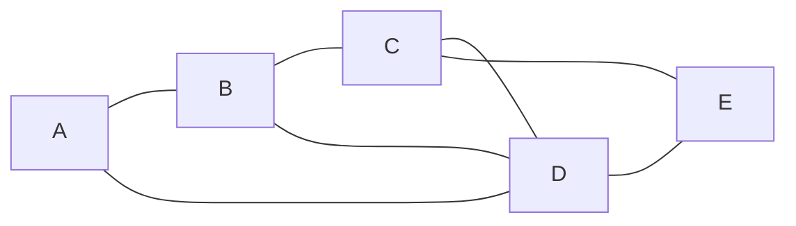

# 计算机网络期末考试

## 选择题

1单选(5分)
‍.应用程序PING 发出的是（   ）报文。

‎
‍

‎
得分/总分

A.
TCP 请求报文  

B.
TCP 应答报文

C.
ICMP 请求报文 

5.00/5.00

D.
ICMP 应答报文

正确答案：C你选对了
2单选(5分)
‏无线电波有四种，分别是中波、短波、超短波和微波.其中关于微波叙述正确的是（   ）。

​
‏

​
得分/总分

A.
沿地面传播，绕射能力强，适用于广播和海上通信

B.
具有较强的电离层反射能力，适用于环球通信

C.
具有极高频率的电磁波，波长很短，主要是直线传播，也可以从物体上得到反射

5.00/5.00

D.
和超短波一样饶射能力都很好，但不可作为视距或超视距中继通信

正确答案：C你选对了
3单选(5分)
​下面有关网桥的说法,错误的是(   ).

‏
​

‏
得分/总分

A.
网桥工作在数据链路层,对网络进行分段,并将两个物理网络连接成一个逻辑网络

B.
网桥可以通过对不要传递的数据进行过滤,并有效的阻止广播数据

5.00/5.00

C.
对于不同类型的网络可以通过特殊的转换网桥进行连接

D.
网桥要处理其接收到的数据,增加了时延

正确答案：B你选对了
4单选(5分)
‏.共有四个站进行码分多址CDMA通信.四个站的码片序列为：

‎
‏a:(-1 -1 -1 +1 +1 -1 +1 +1) b:(-1 -1 +1 -1 +1 +1 +1 -1)

‎
‏c:(-1 +1 -1 +1 +1 +1 -1 -1) d:(-1 +1 -1 -1 -1 -1 +1 -1)

‎
‏现收到这样的码片序列：（-1 +1 -3 +1 -1 -3 +1 +1），则说明（   ）发送了数据1。

‎
‏

‎
得分/总分

A.
a,d 

5.00/5.00

B.
b,d

C.
a,c

D.
b,c

正确答案：A你选对了
5单选(5分)
‏一个主机有两个IP地址，一个地址是192.168.11.25，另一个地址可能是（　 ）。　

‍
‏

‍
得分/总分

A.
192.168.11.0　

B.
192.168.11.26　

C.
192.168.13.25 

5.00/5.00

D.
192.168.11.24

正确答案：C你选对了
6单选(5分)
‌采用 TCP/IP 数据封装时，以下哪项端口号范围标识了所有常用应用程序(    )。

​
‌

​
得分/总分

A.
0～255

B.
256～1022

C.
0～1023

5.00/5.00

D.
1024～2047

正确答案：C你选对了
7单选(5分)
‍如果到达分组的片偏移值为100，分组首部中的首部长度字段值为5，总长度字段值为100，求数据部分的第一个字节的编号与数据部分最后一个字节的编号（   ）。

‍
‍

‍
得分/总分

A.
100 200

B.
100 500

C.
800 879

5.00/5.00

D.
800 900

正确答案：C你选对了
8单选(5分)
‏一个信道的数据率为4kbps，单向传播时延时间为20ms，使停等协议的信道最大利用率是50％，要求帧长至少为（   ）。

​
‏

​
得分/总分

A.
160b

5.00/5.00

B.
80b

C.
320b

D.
100b

正确答案：A你选对了
9单选(5分)
‏主机甲和主机乙之间已建立了一个TCP连接，TCP最大段长度为1000字节，若主机甲的当前拥塞窗口为6000字节，在主机甲向主机乙连续发送三个最大段后，成功收到主机乙发送的对第一个段的确认段，确认段中通告的接收窗口大小为3000字节，则此时主机甲还可以向主机乙发送的最大字节数是（  ）。

‎
‏

‎
得分/总分

A.
1000

5.00/5.00

B.
2000

C.
3000

D.
4000

正确答案：A你选对了
10单选(5分)
‏DHCP客户机申请IP地址租约时首先发送的信息是（   ）

‏
‏

‏
得分/总分

A.
DHCP Discover

5.00/5.00

B.
DHCP Offer

C.
DHCP Request

D.
DHCP Positive

正确答案：A你选对了
11单选(5分)
‍Internet上的域名系统DNS（   ）

‏
‍

‏
得分/总分

A.
可以实现域名之间的转换

B.
只能实现域名到IP地址的转换

C.
只能实现IP地址到域名的转换

D.
可以实现域名到IP地址的转换或反之

5.00/5.00
正确答案：D

## 应用题

### 1. (10 分) 设某网络的结构如下图所示，已知节点 C 到相邻节点 B、D、E 的代价分别为 2，5，3。节点 C 收到从相邻节点 B、D、E 的向量表如下面 3 个表所示。试用距离矢量路由算法为节点 C 计算到各节点的路由表（目的地、下一站、代价）。

源节点 | 目的地 | 代价 || 源节点 | 目的地 | 代价 | | 源节点 | 目的地 | 代价
:---: | :---: | :---: | --- | :---: | :---: | :---: | --- | :---: | :---: | :---:
B | A | 3 || D | A | 2 || E | A | 5  
|| B | 0 || | B | 3 || | B | 4
|| C | 2 || | C | 2 || | C | 2
|| D | 1 || | D | 0 || | D | 2
|| E | 5 || | E | 1 || | E | 0

源节点 | 目的地 | 下一站 | 代价
:---: | :---: | :---: | :---:
 C | A | B | 5
|| B | B | 2
|| C | C | 0
|| D | B | 3
|| E | E | 3

### 2. （17 分）TCP 的拥塞窗口 `cwnd` 大小与传输轮次 $n$ 的关系如下所示：

`cwnd` | 1 | 2 | 4 | 8 | 16 | 32 | 33 | 34 | 35 | 36 | 37 | 38 | 39 | 40 | 41 | 42 | 21 | 22 | 23 | 24 | 25 | 26 | 1 | 2 | 4 | 8
:---: | :---: | :---: | :---: | :---: | :---: | :---: | :---: | :---: | :---: | :---: | :---: | :---: | :---: | :---: | :---: | :---: | :---: | :---: | :---: | :---: | :---: | :---: | :---: | :---: | :---: | :---:
$n$ | 1 | 2 | 3 | 4 | 5 | 6 | 7 | 8 | 9 | 10 | 11 | 12 | 13 | 14 | 15 | 16 | 17 | 18 | 19 | 20 | 21 | 22 | 23 | 24 | 25 | 26

#### （1）指明 TCP 工作在慢开始阶段的时间间隔。

$[1, 6]$ 和 $[23, 26]$。

#### （2）指明 TCP 工作在拥塞避免阶段的时间间隔。

$[6, 16]$ 和 $ [17, 22]$。

#### （3）在第 16 轮次和第 22 轮次之后发送方是通过收到三个重复的确认还是通过超时检测到丢失了报文段？

- 在第 16 轮次之后发送方通过收到三个重复的确认检测到丢失的报文段；
- 在第 22 轮次之后发送方是通过超时检测到丢失的报文段。

#### （4）在第 1 轮次、第 18 轮次和第 24 轮次发送时，门限 `ssthresh` 分别被设置为多大？

- 在第 1 轮次发送时，门限 `ssthresh` 被设置为 32；
- 在第 18 轮次发送时，门限 `ssthresh` 被设置为发生拥塞时的一半，即 21；
- 在第 24 轮次发送时，门限`ssthresh` 是第 18 轮次发送时设置的 21。

#### （5）在第几轮次发送出第 70 个报文段？

在第 7 轮次发送出第 70 个报文段。

#### （6）假定在第 26 轮次之后收到了三个重复的确认，因而检测出了报文段的丢失，那么拥塞窗口 `cwnd` 和门限 `ssthresh` 应设置为多大？

拥塞窗口 `cwnd` 和门限 `ssthresh` 应设置为 8 的一半，即 4。

### 3. （18 分）某网络拓扑如图所示，路由器 $R_1$ 通过接口 $E_1$、$E_2$ 分别连接 $局域网_1$、$局域网_2$，通过接口 $L_0$ 连接路由器 $R_2$，井通过路由器 $R_2$ 连接域名服务器与互联网。$R_1$ 的 $L_0$ 接口的 IP 地址是 `202.118.2.1`，$R_2$ 的 $L_0$ 接口的 IP 地址是 `202.118.2.2`，$L_1$ 接口的 IP 地址是 `130.11.120.1`，$E_0$ 接口的 IP 地址是 `202.118.3.1`，域名服务器的 IP 地址是 `202.118.3.2`。

#### （1）将 IP 地址空间 `202.118.1.0/25` 划分为 2 个子网，分别分配给 $局域网_1$、$局域网_2$，每个局域网需分配的 IP 地址数不少于 60 个。请给出子网划分结果，说明理由或给出必要的计算过程。

#### （2）请给出 $R_1$ 的路由表，使其明确包括到 $局域网_1$ 的路由、$局域网_2$ 的路由、域名、服务器的主机路由和互联网的路由。

目的网络IP地址 | 子网掩码 | 下一跳 IP 地址 | 接口
:---: | :---: | :---: | :---:
202.118.1.0 | 255.255.255.128 | `DIRECT` | $E_1$
202.118.1.128 | 255.255.255.128 | `DIRECT` | $E_2$
202.118.3.2 | 255.255.255.255 | 202.118.2.2 | $L_0$
0.0.0.0 | 0.0.0.0 | 202.118.2.2 | $L_0$

#### （3）请采用路由聚合技术，给出 $R_2$ 到 $局域网_1$ 和 $局域网_2$ 的路由。

目的网络IP地址 | 子网掩码 | 下一跳 IP 地址 | 接口
:---: | :---: | :---: | :---:
202.118.1.0 | 255.255.255.0 | 202.118.2.1 | $L_0$