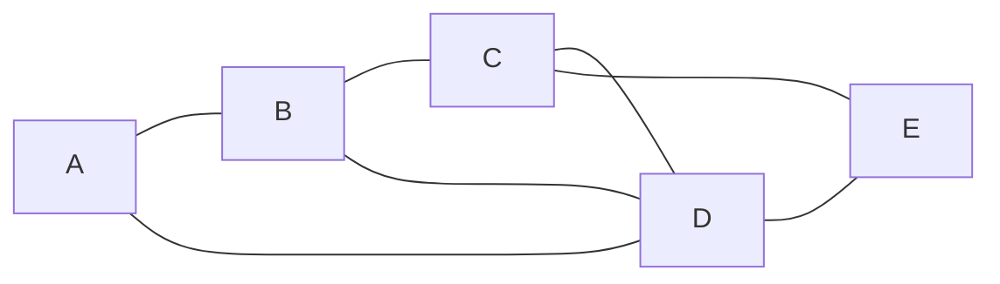
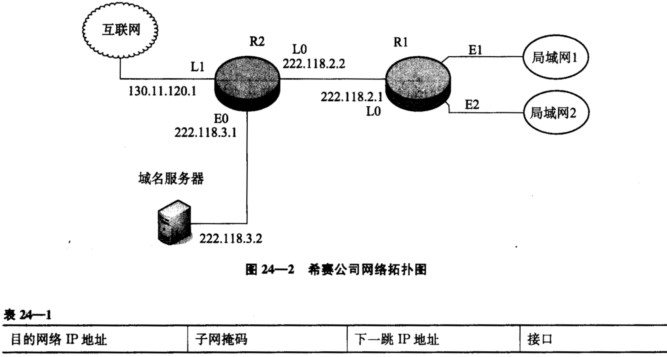

# 计算机网络期末考试

## 选择题

### 1. 【单选】（5 分）应用程序 PING 发出的是（ ）报文。

 - [ ] A. TCP 请求报文  
 - [ ] B. TCP 应答报文
 - [x] C. ICMP 请求报文 
 - [ ] D. ICMP 应答报文

> 正确答案：C
> 
> PING（Packet Internet Groper）是用来测试两个主机的连通性的，PING 使用了 ICMP 的回送请求和回送回答报文，是应用层协议直接使用网络层 ICMP 的一个例子，它没有使用运输层的 TCP 或者 UDP 协议。

### 2. 【单选】（5 分）‏无线电波有四种，分别是中波、短波、超短波和微波，其中关于微波叙述正确的是（ ）。

- [ ] A. 沿地面传播，绕射能力强，适用于广播和海上通信
- [ ] B. 具有较强的电离层反射能力，适用于环球通信
- [x] C. 具有极高频率的电磁波，波长很短，主要是直线传播，也可以从物体上得到反射
- [ ] D. 和超短波一样饶射能力都很好，但不可作为视距或超视距中继通信

> 正确答案：C
> 
> 微波是指波长为 $1 mm$ 到 $10 m$ 波段的无线电波，人们使用微波传输信息时，由于其大致沿直线传播且地球表面不是平面，因此需每隔一定距离 建一个 微波中继站或基地台，信息传输的越远，需要的中继站或基地台越多。微波很容易放地面吸收，又能穿透电离层而不被反射，所以它不能靠地波和天波传播，只能直线传播，没有什么绕射能力。

### 3. 【单选】（5 分）下面有关网桥的说法，错误的是（ ）。

- [ ] A. 网桥工作在数据链路层，对网络进行分段，并将两个物理网络连接成一个逻辑网络
- [x] B. 网桥可以通过对不要传递的数据进行过滤，并有效的阻止广播数据
- [ ] C. 对于不同类型的网络可以通过特殊的转换网桥进行连接
- [ ] D. 网桥要处理其接收到的数据，增加了时延

> 正确答案：B
> 
> 网桥只是利用了 MAC 地址对数据链路层的数据帧进行了转发，对于网络的高层协议而言则是透明的。因此通过网桥和交换机组成的网络仍属于同一个广播域（在不考虑虚拟网的情况下），网络中任何一个站点发出的广播数据包都可被其它站点所接收。因此网桥能够解决信道冲突而不能阻止广播风暴，但注意路由器能隔离广播风暴，所以 B 错误。

### 4. 【单选】（5 分）共有四个站进行码分多址 CDMA 通信，四个站的码片序列为：

- `a: (-1 -1 -1 +1 +1 -1 +1 +1)`
- `b: (-1 -1 +1 -1 +1 +1 +1 -1)`
- `c: (-1 +1 -1 +1 +1 +1 -1 -1)`
- `d: (-1 +1 -1 -1 -1 -1 +1 -1)`

### ‏现收到这样的码片序列：`(-1 +1 -3 +1 -1 -3 +1 +1)`，则说明（ ）发送了数据 1。

- [x] A. `a`，`d` 
- [ ] B. `b`，`d`
- [ ] C. `a`，`c`
- [ ] D. `b`，`c`

> 正确答案：A
> 
> 接收端用相同的码片序列进行规格化内积，就可以将不属于本码片序列的其他信号全部去除，只接受本码片序列所携带的信息。本题方法是用发送端每个站的码片序列依次对混合信号进行规格化内积：结果为 $+1$，说明这个站发送比特 $1$；结果为 $-1$，说明这个站发送比特 $0$；结果为 $0$，说明这个站没有发送信息。带入本题中计算，
> 
> $$
> \begin{aligned}
> S \cdot A &= (+1 & -1 & +3 & +1 & -1 & +3 & +1 & +1) / 8 &= 1 & A 发送 1 \\
> S \cdot B &= (+1 & -1 & -3 & -1 & -1 & -3 & +1 & -1) / 8 &= -1 & B 发送 0 \\
> S \cdot C &= (+1 & +1 & +3 & +1 & -1 & -3 & -1 & -1) / 8 &= 0 & C 没发送 \\
> S \cdot D &= (+1 & +1 & +3 & -1 & +1 & +3 & +1 & -1) / 8 &= 1 & D 发送 1 
> \end{aligned}
> $$

### 5. 【单选】（5 分）一个主机有两个 IP 地址，一个地址是 `192.168.11.25`，另一个地址可能是（ ）。　

- [ ] A. `192.168.11.0`
- [ ] B. `192.168.11.26`
- [x] C. `192.168.13.25`
- [ ] D. `192.168.11.24`

> 正确答案：C
> 
> 本题主要考查对 IP 地址分类和网络互联的理解。在 Internet 中，允许一台主机有两个或两个以上 IP 地址。如果一台主机有两个或两个以上 IP 地址，说明这个主机属于两个或两个以上的逻辑网络。同一时刻一个合法的内网 IP 地址只能分配给一台主机，否则会引起 IP 地址冲突。IP 地址 `192.168.11.25` 属于 C 类私有 IP 地址，网络号为 `192.168.11.0`，所以 A、B、D 属于一个逻辑网络，只有 C 的网络号不同，说明它在不同的逻辑网络。（不要想的太复杂）

### 6. 【单选】（5 分）采用 TCP/IP 数据封装时，以下哪项端口号范围标识了所有常用应用程序（ ）。

- [ ] A. 0 ~ 255
- [ ] B. 256 ~ 1022
- [x] C. 0 ~ 1023
- [ ] D. 1024 ~ 2047

> 正确答案：C
> 
> 端口的取值范围是：0 - 65535。 在这个取值范围中 1023 以下的端口已经分配给了常用的一些应用程序，这个数字以后的端口部分被使用，所以网络编程可用的端口一般在 1024 之后选取。因此端口 0 - 1023，这个是保留范围，基本覆盖了常用协议。例如 HTTP 是 80 端口，FTP 是 20/21 端口，DNS 是 53 端口，SMTP 是 25 端口等等。

### 7. 【单选】（5 分）如果到达分组的片偏移值为 100，分组首部中的首部长度字段值为 5，总长度字段值为 100，求数据部分的第一个字节的编号与数据部分最后一个字节的编号（ ）。

- [ ] A. 100 200
- [ ] B. 100 500
- [x] C. 800 879
- [ ] D. 800 900

> 正确答案：C
> 
> 分片的片偏移值表示其数据部分在原始分组的数据部分中的相对位置，其单位是 $8 B$。首部长度字段以 $4 B$ 为单位，总长度字段以字节为单位。题目中分组的片偏移值为 100，那么其数据部分第一个字节的编号是 800。因为分组的数据部分总长度 $100 B$，首部长度为 $4 \times 5 = 20B$，所以数据部分长度为 $80 B$。那么该分组的数据部分的最后一个字节的编号是 879（注意是从 0 开始编号的）。

### 8. 【单选】（5 分）一个信道的数据率为 $4 kbps$，单向传播时延时间为 $20 ms$，使停等协议的信道最大利用率是 50％，要求帧长至少为（ ）。

- [x] A. $160 b$
- [ ] B. $80 b$
- [ ] C. $320 b$
- [ ] D. $100 b$

> 正确答案：A
> 
> $停等协议的效率 = 发送时延 / 传输总时延 = 发送时延 / (发送时延 + 2 \times 单向传播时延)$，当帧的发送时延等于往返传播时延时，效率将达到 50%。传播时延为 $20 \times 2 = 40 毫秒$，要使发送时延达到 40 毫秒，帧长至少为 $4000 \times 0.04 = 160$ 位。

### 9. 【单选】（5 分）主机甲和主机乙之间已建立了一个 TCP 连接，TCP 最大段长度为 1000 字节，若主机甲的当前拥塞窗口为 6000 字节，在主机甲向主机乙连续发送三个最大段后，成功收到主机乙发送的对第一个段的确认段，确认段中通告的接收窗口大小为 3000 字节，则此时主机甲还可以向主机乙发送的最大字节数是（ ）。

- [x] A. 1000
- [ ] B. 2000
- [ ] C. 3000
- [ ] D. 4000

> 正确答案：A
> 
> 发送方的发送窗口的.上限值应该取接收方窗口和拥塞窗口这两个值中较小的一个，于是此时发送方的发送窗口为 $\min\{6000, 3000\} = 3000$ 字节，由于发送方还没有收到第二个和第三个最大段的确认，所以此时主机甲还可以向主机乙发送的最大字节数为 $3000 - 2000 = 1000$ 字节，正确选项为 A。

### 10. 【单选】（5 分）DHCP 客户机申请 IP 地址租约时首先发送的信息是（ ）。

- [x] A. DHCP Discover
- [ ] B. DHCP Offer
- [ ] C. DHCP Request
- [ ] D. DHCP Positive

> 正确答案：A
> 
> DHCP 工作流程主要分为以下四个步骤: 
> - IP 租用请求：DHCP 客户机初始化 TCP/IP，通过 UDP 端口 67 向网络中发送一个 DHCP Discover 广播包，请求租用 IP 地址。
> - IP 租用提供：任何接收到 DHCP Discover 广播包并且能够提供 IP 地址的 DHCP 服务器，都会通过 UDP 端口 68 给客户机回应一个 DHCP Offer 广播包，提供一个 IP 地址。
> - IP 租用选择：客户机从不止一台 DHCP 服务器接收到提供之后，会选择第一个收到的 DHCP Offer包，并向网络中广播一个 DHCP Request消息包，表明自己已经接受了一个 DHCP 服务器提供的 IP 地址。所有其他的 DHCP 服务器撤销它们的提供以便将 IP 地址提供给下一次 IP 租用请求。
> - IP 租用确认：被客户机选择的 DHCP 服务器在收 DHCP Request 广播后
>   - 即发送 DHCP positive 确认信息，以确定此租约成立，且此信息中还包含其它 DHCP 选项信息。
>   - 当客户机请求的是一个无效的或重复的 IP 地址，则 DHCP 服务器在第五步发送 DHCP Negative 确认信息，客户机收到 DHCP Negative 确认信息初始化失败。

### 11. 【单选】（5 分）Internet 上的域名系统 DNS（ ）。

- [ ] A. 可以实现域名之间的转换
- [ ] B. 只能实现域名到 IP 地址的转换
- [ ] C. 只能实现 IP 地址到域名的转换
- [x] D. 可以实现域名到 IP 地址的转换或反之

> 正确答案：D
> 
> 域名到 IP 地址叫正向解析，IP 转换成域名叫反向解析。正向解析用的必较多，反向解析用的比较少。反向解析现在很多的反垃圾邮件服务（新浪邮箱等和很多国外的邮件服务器）会用到这个功能，就是当收到某个 IP 发过来的一个邮件的时候，做一个反向解析，如果可以解析出域名来则通过这个邮件，解析不出来域名就当作垃圾邮件处理了。

## 应用题

### 1. (10 分) 设某网络的结构如下图所示，已知节点 C 到相邻节点 B、D、E 的代价分别为 2，5，3。节点 C 收到从相邻节点 B、D、E 的向量表如下面 3 个表所示。试用距离矢量路由算法为节点 C 计算到各节点的路由表（目的地、下一站、代价）。

源节点 | 目的地 | 代价 || 源节点 | 目的地 | 代价 | | 源节点 | 目的地 | 代价
:---: | :---: | :---: | --- | :---: | :---: | :---: | --- | :---: | :---: | :---:
B | A | 3 || D | A | 2 || E | A | 5  
|| B | 0 || | B | 3 || | B | 4
|| C | 2 || | C | 2 || | C | 2
|| D | 1 || | D | 0 || | D | 2
|| E | 5 || | E | 1 || | E | 0

源节点 | 目的地 | 下一站 | 代价
:---: | :---: | :---: | :---:
 C | A | B | 5
|| B | B | 2
|| C | C | 0
|| D | B | 3
|| E | E | 3

> 源节点即发送数据的源点，C 可以到 ABCDE 中去，所以目的地要写有 ABCDE，至于下一站要这样看，C 要到 A 的话，那么 C 可以有三种路径，但是要代价最少的，所以就是先到 B 再到 A，C 到 B 代价为 2，B 到 A 代价为 3，故代价为 5，同理……至于与 C 相邻的节点，直接下一站就是它自己了。

### 2. （17 分）TCP 的拥塞窗口 `cwnd` 大小与传输轮次 $n$ 的关系如下所示：

`cwnd` | 1 | 2 | 4 | 8 | 16 | 32 | 33 | 34 | 35 | 36 | 37 | 38 | 39 | 40 | 41 | 42 | 21 | 22 | 23 | 24 | 25 | 26 | 1 | 2 | 4 | 8
:---: | :---: | :---: | :---: | :---: | :---: | :---: | :---: | :---: | :---: | :---: | :---: | :---: | :---: | :---: | :---: | :---: | :---: | :---: | :---: | :---: | :---: | :---: | :---: | :---: | :---: | :---:
$n$ | 1 | 2 | 3 | 4 | 5 | 6 | 7 | 8 | 9 | 10 | 11 | 12 | 13 | 14 | 15 | 16 | 17 | 18 | 19 | 20 | 21 | 22 | 23 | 24 | 25 | 26

#### （1）指明 TCP 工作在慢开始阶段的时间间隔。

慢开始时间间隔：$[1, 6]$ 和 $[23, 26]$。

#### （2）指明 TCP 工作在拥塞避免阶段的时间间隔。

拥塞避免时间间隔：$[6, 16]$ 和 $ [17, 22]$。

#### （3）在第 16 轮次和第 22 轮次之后发送方是通过收到三个重复的确认还是通过超时检测到丢失了报文段？

- 在第 16 轮次之后发送方通过收到三个重复的确认检测到丢失的报文段；
- 在第 22 轮次之后发送方是通过超时检测到丢失的报文段。

#### （4）在第 1 轮次、第 18 轮次和第 24 轮次发送时，门限 `ssthresh` 分别被设置为多大？

- 在第 1 轮次发送时，门限 `ssthresh` 被设置为 32；
- 在第 18 轮次发送时，门限 `ssthresh` 被设置为发生拥塞时的一半，即 21；
- 在第 24 轮次发送时，门限`ssthresh` 是第 18 轮次发送时设置的 21。

#### （5）在第几轮次发送出第 70 个报文段？

在第 7 轮次发送出第 70 个报文段。

#### （6）假定在第 26 轮次之后收到了三个重复的确认，因而检测出了报文段的丢失，那么拥塞窗口 `cwnd` 和门限 `ssthresh` 应设置为多大？

拥塞窗口 `cwnd` 和门限 `ssthresh` 应设置为 8 的一半，即 4。

### 3. （18 分）某网络拓扑如图所示，路由器 $R_1$ 通过接口 $E_1$、$E_2$ 分别连接 $局域网_1$、$局域网_2$，通过接口 $L_0$ 连接路由器 $R_2$，井通过路由器 $R_2$ 连接域名服务器与互联网。$R_1$ 的 $L_0$ 接口的 IP 地址是 `202.118.2.1`，$R_2$ 的 $L_0$ 接口的 IP 地址是 `202.118.2.2`，$L_1$ 接口的 IP 地址是 `130.11.120.1`，$E_0$ 接口的 IP 地址是 `202.118.3.1`，域名服务器的 IP 地址是 `202.118.3.2`。

#### （1）将 IP 地址空间 `202.118.1.0/25` 划分为 2 个子网，分别分配给 $局域网_1$、$局域网_2$，每个局域网需分配的 IP 地址数不少于 60 个。请给出子网划分结果，说明理由或给出必要的计算过程。

CIDR 中的子网号可以全 0 或全 1，但主机号不能全 0 或全 1。因此若将 IP 地址空间 `202.118.1.0/25` 划分为 2 个子网，且每个局域网需分配的 IP 地址个数不少于60个，子网号至少要占用一位。由 $2^5 - 2 < 60 < 2^6 - 2$ 可知，主机号至少要占用 5 位。由于源 IP 地址空间的网络前缀为 25 位，因此 $主机号位数 + 子网号位数 = 7$。综上可得主机号位数为 6，子网号位数为 1。

- 子网的划分结果
  - $子网_1$：`202.118.1.0/26`
  - $子网_2$：`202.118.1.64/26`
- 地址分配方案
  - $子网_1$ 分配给 $局域网_1$，$子网_2$ 分配给 $局域网_2$；
  - $子网_1$ 分配给 $局域网_2$，$子网_2$ 分配给 $局域网_1$。

#### （2）请给出 $R_1$ 的路由表，使其明确包括到 $局域网_1$ 的路由、$局域网_2$ 的路由、域名、服务器的主机路由和互联网的路由。

由于 $局域网_1$ 和 $局域网_2$ 分别与路由器 $R_1$ 的 $E_1、E_2$ 接口直接相连，因此在 $R_1$ 的路由表中，目的网络为局域网1的转发路径是直接通过接口 $E_1$ 转发的，目的网络为 $局域网_2$ 的转发路径是直接通过接口 $E_1$ 转发的。由于 $局域网_{1、2}$ 的网络前缀均为 26 位，因此它们的子网掩码均为 `255.255.255.192`。

$R_1$ 专门为域名服务器设定了一个特定的路由表项，因此该路由表项中的子网掩码应为 `255.255.255.255`（只有和全 1 的子网掩码相与才能完全保证和目的 IP 地址一样，从而选择该特定路由）。对应的下一跳转发地址是 `202.118.2.2`，转发接口是 $L_0$。

$R_1$ 到互联网的路由实质上相当于一个默认路由（即当某一目的网络 IP 地址与路由表中其他任何一项都不匹配时，则匹配该默认路表项），默认路由一般写作 `0/0`，即目的地址为 `0.0.0.0`，子网掩码为 `0.0.0.0`。对应的下一跳转发地址是 202.118.2.2，转发接口是 $L_0$。

综上可得到路由器 $R_1$ 的路由表为：

（若 $子网_1$ 分配给 $局域网_1$，$子网_2$ 分配给 $局域网_2$）

目的网络IP地址 | 子网掩码 | 下一跳 IP 地址 | 接口
:---: | :---: | :---: | :---:
202.118.1.0 | 255.255.255.192 | `DIRECT` | $E_1$
202.118.1.64 | 255.255.255.192 | `DIRECT` | $E_2$
202.118.3.2 | 255.255.255.255 | 202.118.2.2 | $L_0$
0.0.0.0 | 0.0.0.0 | 202.118.2.2 | $L_0$

（若 $子网_1$ 分配给 $局域网_2$，$子网_2$ 分配给 $局域网_1$）

目的网络IP地址 | 子网掩码 | 下一跳 IP 地址 | 接口
:---: | :---: | :---: | :---:
202.118.1.64 | 255.255.255.192 | `DIRECT` | $E_1$
202.118.1.0 | 255.255.255.192 | `DIRECT` | $E_2$
202.118.3.2 | 255.255.255.255 | 202.118.2.2 | $L_0$
0.0.0.0 | 0.0.0.0 | 202.118.2.2 | $L_0$

#### （3）请采用路由聚合技术，给出 $R_2$ 到 $局域网_1$ 和 $局域网_2$ 的路由。

$局域网_1$ 和 $局域网_2$ 的地址可以聚合为 `202.118.1.0/25`，而对于路由器 $R_2$ 来说，通往 $局域网_1$ 和 $局域网_2$ 的转发路径都是从 $L_O$ 接口转发，因此采用路由聚合技术后，路由器 $R_2$ 到 $局域网_1$ 和 $局域网_2$ 的路由为:

目的网络IP地址 | 子网掩码 | 下一跳 IP 地址 | 接口
:---: | :---: | :---: | :---:
202.118.1.0 | 255.255.255.128 | 202.118.2.1 | $L_0$