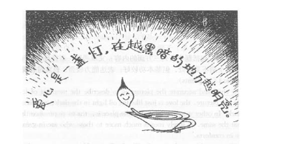

Among all the worthy feelings of mankind, love is probably the noblest, but everyone has his/her own understanding of it.  
There has been a discussion recently on the issue in a newspaper. Write an essay to the newspaper to

1. show your understanding of the symbolic meaning of the picture below,
2. give a specific example, and
3. give your suggestion as to the best way to show love.

You should write about 200 words on ANSWER SHEET 2. (20 points)

 

 
